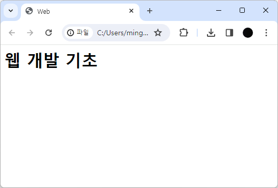
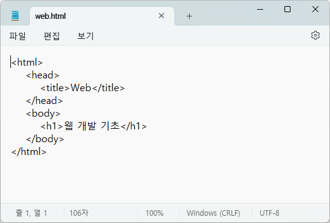

<div align="center">
  
</div>

# HTML

## HTML의 정의

일만 문서와 웹 문서는 큰 차이가 있다. 엑셀 문서를 비롯한 일반 문서는 내용을 입력하는 프로그램과 나중에 그 내용을 확인하는 프로그램이 같지만 웹 문서는 문서를 작성하는 프로그램과 그 내용을 보는 프로그램이 서로 다르다. 

* `웹 편집기` 웹문서를 작성하는 프로그램
* `웹 브라우저` 웹 문서를 보는 프로그램

> 웹 편집기 - 텍스트 편집기, 웹 편집기, 통합개발환경 등

> 웹 브라우저 - 인터넷 익스플로러(Internet Explorer), 엣지(Edge), 크롬(Chrome), 파이어폭스(Firefox) 등

### 그렇다면 HTML이란 무엇일까?

HyperText Markup Language의 줄임말로 말 그대로 해석하면 하이퍼텍스트를 마크업하는 언어이다.

* `하이퍼텍스트(HT)` 웹 사이트에서 링크를 클릭해 다른 문서나 사이트로 즉시 이동할 수 있는 기능
* `마크업(M)` 태그(tag)를 사용해 문서에서 어느 부분이 제목이고 본문인지 표시하는 것

**웹에서 자유롭게 오갈 수 있는 웹 문서를 만드는 언어가 HTML이라고 정리할 수 있다.**

| 웹 브라우저 | 메모장 |
| :-: | :-: |
|  |  |

<br>

## 웹 표준

웹 사이트를 만들 때 지켜야 하는 약속들을 정리한 것.

* `일반 사용자` 장소나 브라우저와 상관없이 쉽게 웹 사이트를 볼 수 있다.
* `웹 개발자` 시간을 절약할 수 있다.

> **웹 표준**으로 문서 하나를 만들면 어떤 기기에서나 볼 수 있다.

<br>

## HTML 기본 문서 구조

```html
<!DOCTYPE html>
<html lang="en">
<head>
    <meta charset="UTF-8">
    <meta name="viewport" content="width=device-width, initial-scale=1.0">
    <title>Document</title>
</head>
<body>
    <h1>웹 개발 기초</h1>
</body>
</html>
```

- `<!doctype>` 문서 유형을 지정하는 선언문

> 웹 브라우저에게 '이제부터 처리할 문서는 HTML 문서이고 어떤 유형을 사용했으니 그 버전에 맞는 방법으로 해석하라.'라고 알려주는 것

- `<html>` 웹 문서 시작을 알리는 태그

- `<head>` 브라우저에게 정보를 주는 태그
  
- `<meta>` 문자 세트를 비롯한 문서 정보
  
- `<body>` 실제 브라우저에 표시될 내용

<br>

## 참고 자료

- [Do it! HTML5+CSS3 웹 표준의 정석](https://book.naver.com/bookdb/book_detail.nhn?bid=15975063)