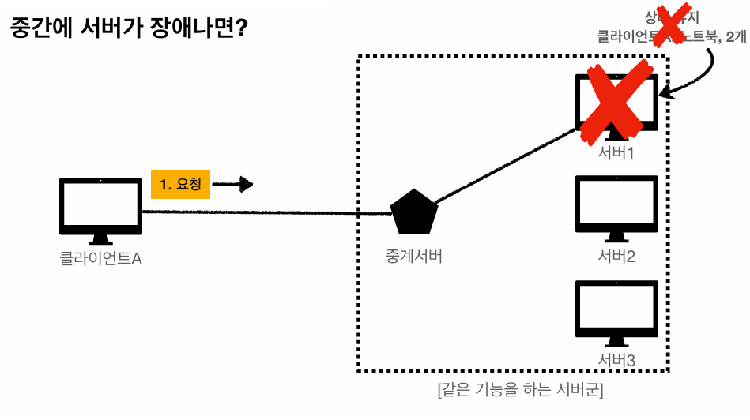
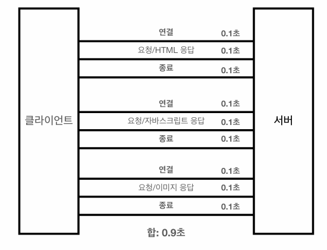
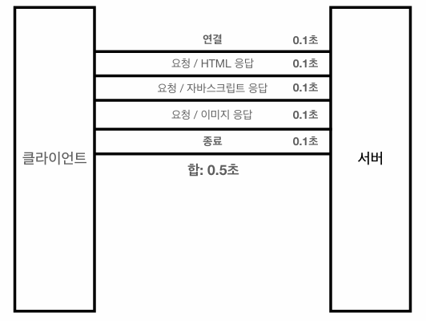

## HTTP (HyperText Transfer Protocol)

하이퍼텍스트 문서를 통해서 연결할 수 있는 html을 전송하는 프로토콜로 처음 시작이 되었으나 지금은 HTTP 메시지에 모든 것을 전송할 수 있다.

> HTML, TEXT, 이미지, 음성, 영상, 파일, JSON 등등

### 기반 프로토콜

* TCP : HTTP/1.1, HTTP/2
* UDP : HTTP/3

### HTTP 특징

* 클라이언트-서버 구조로 동작한다.
* 무상태 프로토콜(Stateless)을 지향한다.
* 비연결성
* HTTP 메시지를 통해서 통신한다.
* 단순하고 확장 가능하다.

 

## 클라이언트 서버 구조

* 요청(Request) 응답(Response) 구조
* 클라이언트는 서버에 요청을 보내고, 응답을 대기한다.
* 서버가 요청에 대한 결과를 만들어서 응답한다.

 

## 무상태 프로토콜 (Stateless)

* 서버가 클라이언트의 상태를 보존하지 않는다
* 장점 : 서버 확장성이 높다
* 단점 : 클라이언트가 추가로 데이터를 전송해야 된다.

### Stateful, Stateless 차이

> 고객이 노트북을 구매하는 상황

* 상태 유지 : 중간에 다른 점원으로 바뀌면 안된다.
  * 중간에 점원이 바뀔 때 상태 정보를 다른 점원에게 미리 알려야 한다.
* 무상태 : 중간에 다른 점원으로 바뀌어도 된다.
* 무상태는 응답 서버를 쉽게 바꿀 수 있다
  * 무한한 서버 증설 가능

### Stateful

### Stateless

> 수평 확장에 유리하다.

### Stateless 실무 한계

* 무상태로 설계할 수 있는 경우도 있고 없는 경우도 있다.
* ex) 로그인
* 로그인한 사용자의 경우 로그인 했다는 상태를 서버에 유지
* 일반적으로 브라우저 쿠키와 서버 세션 등을 사용해서 상태 유지
* 상태 유지는 최소한만 사용해야한다.

 

## 비 연결성 (Connectionless)

* HTTP는 기본이 연결을 유지하지 않는 모델이다.
* 일반적으로 초 단위 이하의 빠른 속도로 응답한다.
* 1시간 동안 수천명이 서비스를 사용해도 실제 서버에서 동시에 처리하는 요청은 수십개 이하로 매우 작다.
* 서버 자원을 매우 효율적으로 사용할 수 있다.

### 비 연결성 한계 및 극복

* TCP/IP 연결을 새로 맺어야 한다. - 3 way handshake
* 웹 브라우저로 사이트를 요청하면 HTML 뿐만 아니라 js, css, 추가 이미지 등 수 많은 자원이 함께 다운로드된다.
* 지금은 `HTTP 지속 연결(Persistent Connections)`로 문제를 해결했다.

> HTTP/2, HTTP/3에서 더 많은 최적화

| HTTP 초기 | HTTP 지속 연결 |
| :-: | :-: |
|  |  |