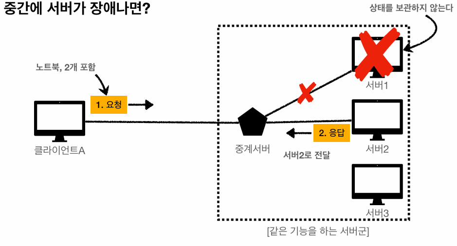

## HTTP (HyperText Transfer Protocol)

하이퍼텍스트 문서를 통해서 연결할 수 있는 html을 전송하는 프로토콜로 처음 시작이 되었으나 지금은 HTTP 메시지에 모든 것을 전송할 수 있다.

> HTML, TEXT, 이미지, 음성, 영상, 파일, JSON 등등

### 기반 프로토콜

* TCP : HTTP/1.1, HTTP/2
* UDP : HTTP/3

### HTTP 특징

* 클라이언트-서버 구조로 동작한다.
* 무상태 프로토콜(Stateless)을 지향한다.
* 비연결성
* HTTP 메시지를 통해서 통신한다.
* 단순하고 확장 가능하다.

<br>

## 클라이언트 서버 구조

* 요청(Request) 응답(Response) 구조
* 클라이언트는 서버에 요청을 보내고, 응답을 대기한다.
* 서버가 요청에 대한 결과를 만들어서 응답한다.

<br>

## 무상태 프로토콜 (Stateless)

* 서버가 클라이언트의 상태를 보존하지 않는다
* 장점 : 서버 확장성이 높다
* 단점 : 클라이언트가 추가로 데이터를 전송해야 된다.

### Stateful, Stateless 차이

> 고객이 노트북을 구매하는 상황

* 상태 유지 : 중간에 다른 점원으로 바뀌면 안된다.
  * 중간에 점원이 바뀔 때 상태 정보를 다른 점원에게 미리 알려야 한다.
* 무상태 : 중간에 다른 점원으로 바뀌어도 된다.
* 무상태는 응답 서버를 쉽게 바꿀 수 있다
  * 무한한 서버 증설 가능

### Stateful


### Stateless



> 수평 확장에 유리하다.

### Stateless 실무 한계

* 무상태로 설계할 수 있는 경우도 있고 없는 경우도 있다.
* ex) 로그인
* 로그인한 사용자의 경우 로그인 했다는 상태를 서버에 유지
* 일반적으로 브라우저 쿠키와 서버 세션 등을 사용해서 상태 유지
* 상태 유지는 최소한만 사용해야한다.

<br>

## 비 연결성 (Connectionless)

* HTTP는 기본이 연결을 유지하지 않는 모델이다.
* 일반적으로 초 단위 이하의 빠른 속도로 응답한다.
* 1시간 동안 수천명이 서비스를 사용해도 실제 서버에서 동시에 처리하는 요청은 수십개 이하로 매우 작다.
* 서버 자원을 매우 효율적으로 사용할 수 있다.

### 비 연결성 한계 및 극복

* TCP/IP 연결을 새로 맺어야 한다. - 3 way handshake
* 웹 브라우저로 사이트를 요청하면 HTML 뿐만 아니라 js, css, 추가 이미지 등 수 많은 자원이 함께 다운로드된다.
* 지금은 `HTTP 지속 연결(Persistent Connections)`로 문제를 해결했다.

> HTTP/2, HTTP/3에서 더 많은 최적화

| HTTP 초기 | HTTP 지속 연결 |
| :-: | :-: |
|  |  |

<br>

## HTTP 메시지

```
[HTTP 요청 메시지]
1. GET /search?q=hello&hl=ko HTTP/1.1 
2. Host: www.google.com 
3. 
```

```
[HTTP 응답 메시지]
1. HTTP/1.1 200 OK 
2. Content-Type: text/html;charset=UTF-8 
   Content-Length: 3423
3. 
4. <html> 
     <body>...</body> 
   </html>
```

1. start-line 시작 라인
2. header 헤더
3. empty line 공백 라인 (CRLF)
4. message body

### 시작 라인 - 요청 메시지

```
GET /search?q=hello&hl=ko HTTP/1.1 
```

* start-line = request-line / status-line
* request-line = method SP request-target SP HTTP-version CRLF
  * HTTP 메서드 (GET : 조회) / 요청 대상 (/search?q=hello&hl=ko) / HTTP Version

<b>HTTP 메서드</b>

* 종류 : GET, POST, PUT, DELETE...
* 서버가 수행해야 할 동작 지정
  * GET : 리소스 조회
  * POST : 요청 내역 처리

<b>요청 대상</b>

* absolute-path[?query] (절대경로[?쿼리])
* 절대경로= "/"로 시작하는 경로

> 다른 방식도 존재

### 시작 라인 - 응답 메시지

```
HTTP/1.1 200 OK
```

* start-line = request-line / status-line
* status-line = HTTP-version SP status-code SP reason-phrase CRLF
  * HTTP 버전 / HTTP 상태 코드 : 요청 성공, 실패를 나타냄 / 이유 문구 : 사람이 이해할 수 있는 짧은 상태 코드 설명 글

> HTTP 상태 코드 - 200 : 성공 / 400 : 클라이언트 요청 오류 / 500 : 서버 내부 오류

### HTTP 헤더

```
Host: www.google.com
```
```
Content-Type: text/html;charset=UTF-8 
Content-Length: 3423 
```
header-field = field-name ":" OWS(띄어쓰기 허용용) field-value OWS

* HTTP 전송에 필요한 모든 부가정보
  * 메시지 바디 내용, 메시지 바디 크기, 압축, 인증, 요청 클라이언트 정보 등등
* 표준 헤더가 굉장히 많음
* 필요시 임의의 헤더 추가 가능

### HTTP 메시지 바디

```
<html> 
  <body>...</body> 
</html>
```

* 실제 전송할 데이터
* HTML 문서, 이미지, 영상, JSON 등 byte로 표현할 수 있는 모든 데이터 전송 가능

<br>

## reference

<a href="https://www.inflearn.com/course/http-%EC%9B%B9-%EB%84%A4%ED%8A%B8%EC%9B%8C%ED%81%AC">
모든 개발자를 위한 HTTP 웹 기본 지식 강의</a>