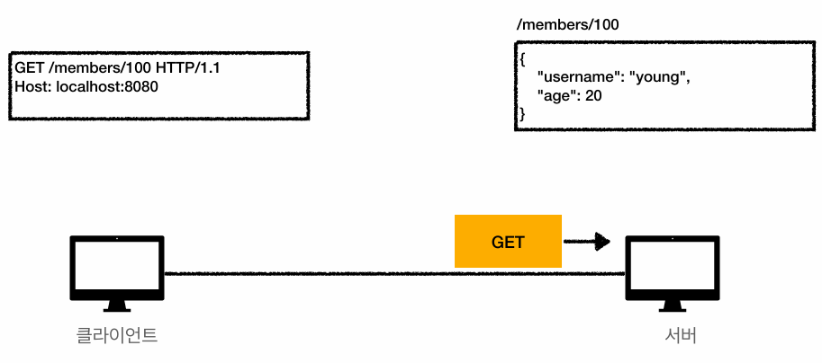
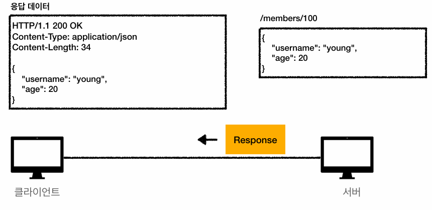
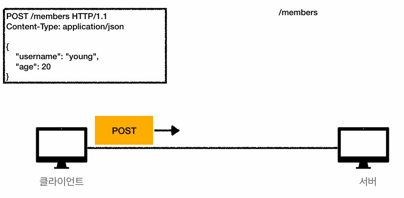
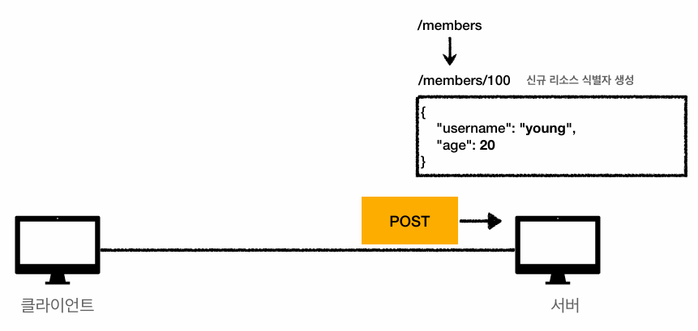
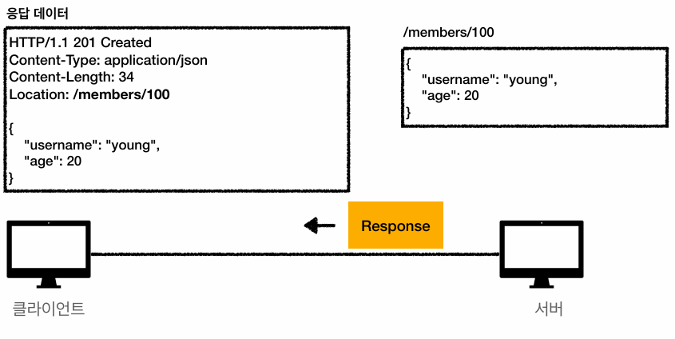
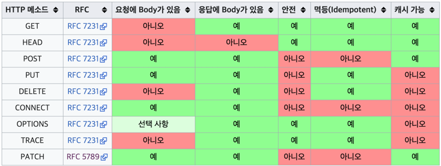

## HTTP API 만들기

### API URI 설계
```
회원 목록 조회 /read-member-list
회원 조회 /read-member-by-id
회원 등록 /create-member
회원 수정 /update-member
회원 삭제 /delete-member
```

이것은 좋은 URI 설계일까? 가장 중요한 것은 `리소스 식별`이다.

* 리소스란?
  * 회원을 등록하고 수정하고 조회하는게 리소스가 아니다.
  * 회원이라는 개념 자체가 바로 리소스다.
* 리소스를 어떻게 식별하면 좋을까?
  * 회원을 등록하고 수정하고 조회하는 것을 모두 배제한다.
  * 회원이라는 리소스만 식별하면 된다.
    → 회원 리소스를 URI에 매핑하면 된다.

### API URI 설계 - 리소스 식별, URI 계층 구조 활용

```
회원 목록 조회 /members
회원 조회 /members/{id}
회원 등록 /members/{id}
회원 수정 /members/{id}
회원 삭제 /members/{id}
```

조회, 등록, 수정, 삭제를 어떻게 구분할까?

* URI는 리소스만 식별해야 한다.
* 리소스와 해당 리소스를 대상으로 하는 행위를 분리한다.
  * 리소스 : 회원
  * 행위 : 조회, 등록, 삭제, 변경

> 리소스는 명사, 행위는 동사

<br>

## HTTP 메서드

주요 메서드

* GET : 리소스 조회
* POST : 요청 데이터 처리, 주로 등록에 사용
* PUT : 리소스를 대체, 해당 리소스가 없으면 생성
* PATCH : 리소스 부분 변경
* DELETE : 리소스 삭제
<hr>
기타 메서드

* HEAD : GET과 동일하지만 메시지 부분을 제외하고, 상태 줄과 헤더만 반환
* OPTIONS: 대상 리소스에 대한 통신 가능 옵션(메서드)을 설명(주로 CORS에서 사용)
* CONNECT: 대상 리소스로 식별되는 서버에 대한 터널을 설정
* TRACE: 대상 리소스에 대한 경로를 따라 메시지 루프백 테스트를 수행

<br>

## GET

* 리소스 조회
* 서버에 전달하고 싶은 데이터는 query를 통해서 전달
* 메시지 바디를 사용해서 데이터를 전달할 수 있지만, 권장하지 않는다.

<b>1. 메시지 전달</b>


<b>2. 서버 도착</b>



<b>3. 응답 데이터</b>



<br>

## POST

* 요청 데이터 처리
* 메시지 바디를 통해 서버로 요청 데이터 전달
* 서버는 요청 데이터를 처리
* 주로 전달된 데이터로 신규 리소스 등록, 프로세스 처리에 사용

<b>1. 메시지 전달</b>



<b>2. 신규 리소스 생성</b>



<b>3. 응답 데이터</b>



POST 메서드는 대상 리소스가 리소스의 고유 한 의미 체계에 따라 요청에 포함된 표현을 처리하도록 요청한다.

* HTML 양식에 입력된 필드와 같은 데이터 블록을 데이터 처리 프로세스에 제공
* 게시판, 뉴스 그룹, 메일링 리스트, 블로그 또는 유사한 기사 그룹에 메시지 게시
* 서버가 아직 식별하지 않은 새 리소스 생성
* 기존 자원에 데이터 추가

> 이 리소스 URI에 POST 요청이 오면 요청 데이터를 어떻게 처리할지 리소스마다 따로 정해야 한다 → 정해진 것이 없음

<br>

## PUT

* 리소스를 대체한다.
  * 리소스가 있으면 대체
  * 없으면 생성
* `클라이언트가 리소스를 식별`
  * 클라이언트가 리소스 위치를 알고 URI 지정 → POST와 차이점

> 기존 리소스를 완전히 대체한다.

<br>

## PATCH

* 리소스를 부분 변경하려고 할때 사용한다.
* 예) 특정 필드만 변경하려고 할때

<br>

## DELETE

* 리소스를 제거할때 사용한다.

<br>

## HTTP 메서드의 속성



### 안전 Safe

* 호출해도 리소스를 변경하지 않는다.
* 안전은 해당 리소스만 고려한다.

### 멱등 Idempotent

* f(f(x)) = f(x)
* 한 번 호출하든 두 번 호출하든 100번 호출하든 결과가 똑같다.
  * GET : 몇 번을 조회하든 같은 결과가 조회된다.
  * PUT : 결과를 대체한다. 따라서 같은 요청을 여러번 해도 최종결과가 같다.
  * DELETE : 결과를 삭제한다. 같은 요청을 여러번 해도 삭제된 결과는 똑같다.

> 자동 복구 메커니즘에 사용할 수 있다. <br>
> 예) DELETE를 호출했을때 DELETE가 잘 됬는지 확인하기 위해서 재시도 할 수 있음

* 재요청 중간에 다른 곳에서 리소스를 변경해버리면? → 외부요인으로 중간에 리소스가 변경되는 것 까지는 고려하지 않는다.

### 캐시가능 Cacheable

* 응답 결과 리소스를 캐시해서 사용해도 되는가?
* GET, HEAD, POST, PATCH는 캐시가 가능하지만 실제로는 GET, HEAD 정도만 캐시로 사용한다.
  * POST, PATCH는 본문 내용까지 캐시 키로 고려해야 하는데, 구현이 쉽지 않다.

> 캐시 : 서버 지연을 줄이기 위해 웹 페이지, 이미지, 기타 유형의 웹 멀티미디어 등의 웹 문서들을 임시 저장하기 위한 정보기술

<br>

## reference

<a href="https://www.inflearn.com/course/http-%EC%9B%B9-%EB%84%A4%ED%8A%B8%EC%9B%8C%ED%81%AC">
모든 개발자를 위한 HTTP 웹 기본 지식 강의</a>