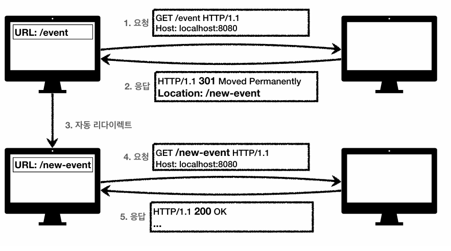
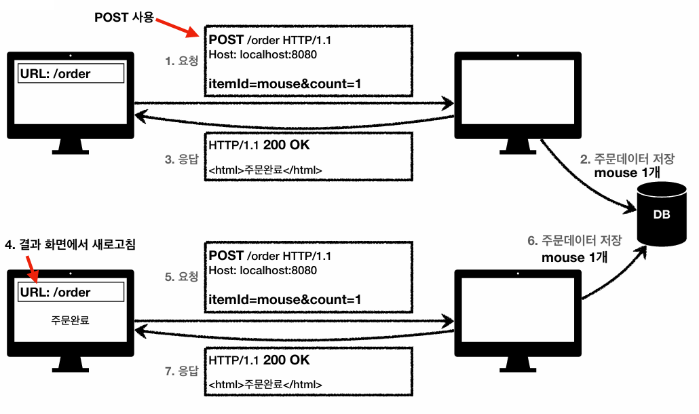
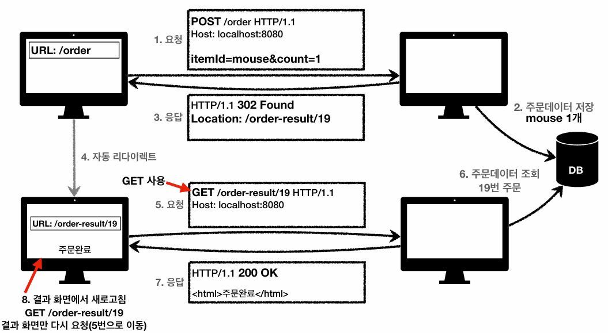

## HTTP 상태코드

클라이언트가 보낸 요청의 처리 상태를 응답에서 알려주는 기능이다.

* 1xx (Informational): 요청이 수신되어 처리중
* 2xx (Successful): 요청 정상 처리
* 3xx (Redirection): 요청을 완료하려면 추가 행동이 필요
* 4xx (Client Error): 클라이언트 오류, 잘못된 문법등으로 서버가 요청을 수행할 수 없음
* 5xx (Server Error): 서버 오류, 서버가 정상 요청을 처리하지 못함

> 1xx 는 거의 사용하지 않음

### 만약 모르는 상태코드가 나타나면?

* 클라이언트는 상위 상태코드로 해석해서 처리
* 미래에 새로운 상태코드가 추가되어도 클라이언트를 변경하지 않아도 됨

```
299 ??? → 2xx (Successful)
451 ??? → 4xx (Client Error)
599 ??? → 5xx (Server Error)
```

<br>

## 2xx (Successful)

### 200 OK - 요청 성공

```
[요청]
GET /members/100 HTTP/1.1
Host: localhost:8080
```

```
[응답]
HTTP/1.1 200 OK
Content-Type: application/json
Content-Length: 34

{
    "username": "young", 
    "age": 20
}
```

### 201 Created - 요청 성공해서 새로운 리소스가 생성됨

```
[요청]
POST /members HTTP/1.1
Content-Type: application/json

{
    "username": "young", 
    "age": 20 
}
```

```
[응답]
HTTP/1.1 201 Created
Content-Type: application/json
Content-Length: 34
Location: /members/100

{
    "username": "young", 
    "age": 20 
}
```

> 생성된 리소스는 응답의 Location 헤더 필드로 식별

### 202 Accepted - 요청이 접수되었으나 처리가 완료되지 않았음

* 배치 처리 같은 곳에서 사용한다.

### 204 No Content - 서버가 요청을 성공적으로 수행했지만, 응답 페이로드 본문에 보낼 데이터가 없음

예) 웹 문서 편집기에서 save 버튼
* save 버튼의 결과로 아무 내용이 없어도 된다.
* save 버튼을 눌러도 같은 화면을 유지해야 한다.
* 결과 내용이 없어도 204 메시지만으로 성공을 인식할 수 있다.

<br>

## 3xx (Redirection)

웹 브라우저는 3xx 응답의 결과에 Location 헤더가 있으면, Location 위치로 자동 이동 → 리다이렉트


[자동 리다이렉트 흐름]



* 영구 리다이렉션 - 특정 리소스의 URI가 영구적으로 이동
* 일시 리다이렉션 - 일시적인 변경 ex) 주문 완료 후 주문 내역 화면으로 이동
* 특수 리다이렉션 - 결과 대신 캐시를 사용

### 영구 리다이렉션 - 301, 308

* 리소스의 URI가 영구적으로 이동
* 원래의 URI를 사용X, 검색 엔진 등에서도 변경을 인지할 수 있을
* 301 Moved Permanently - 리다이렉트시 요청 메서드가 GET으로 변하고, 본문이 제거될 수 있음
* 308 Permanent Redirect - 301과 기능은 같지만, 리다이렉트시 요청 메서드와 본문을 유지(처음 POST를 보내면 리다이렉트도 POST 유지)

### 일시적인 리다이렉션 - 302, 307, 303

리소스의 URI가 일시적으로 변경, 따라서 검색 엔진 등에서 URL을 변경하면 안된다.
* 302 Found - 리다이렉트시 요청 메서드가 GET으로 변하고, 본문이 제거될 수 있음
* 307 Temporary Redirect - 302와 기능은 같지만, 리다이렉트시 요청 메서드와 본문 유지
* 303 See Other - 302와 기능은 같지만, 리다이렉트시 요청 메서드가 GET으로 변경

### PRG패턴: Post/Redirect/Get

POST로 주문후에 웹 브라우저를 새로고침한다면? → 중복 주문이 될 수 있다.



<br>

PRG패턴을 사용하면 POST로 주문후에 새로고침으로 인한 중복 주문을 방지할 수 있다.
* POST로 주문후에 주문 결과 화면을 GET 메서드로 리다이렉트
* 새로고침해도 결과 화면을 GET으로 조회
* 중복 주문 대신에 결과 화면만 GET으로 다시 요청



PRG 이후 리다이렉스시 → URL이 이미 POST에서 GET으로 리다이렉트 되었기 때문에 새로고침을 해도 GET으로 결과 화면만 조회된다.

### 기타 리다이렉션 - 300, 304

* 300 Multiple Choices : 사용하지 않음
* 304 Not Modified
  * 캐시를 목적으로 사용
  * 클라이언트에게 리소스가 수정되지 않았음을 알려준다. 따라서 클라이언트는 로컬PC에 저장된 캐시를 재사용한다. (캐시로 리다이렉트 한다.)
  * 304 응답은 응답에 메시지 바디를 포함하면 안된다. (로컬 캐시를 사용해야 하므로)
  * 조건부 GET, HEAD 요청시 사용

<br>

## 4xx (Client Error)

* 클라이언트의 요청에 잘못된 문법 등으로 서버가 요청을 수행할 수 없음
* 오류의 원인이 클라이언트에 있음
* 클라이언트가 이미 잘못된 요청, 데이터를 보내고 있기 때문에, 똑같은 재시도가 실패함

### 400 Bad Request - 클라이언트가 잘못된 요청을 해서 서버가 요청을 처리할 수 없음

* 요청 구문, 메시지 등등 오류
* 클라이언트는 요청 내용을 다시 검토하고 보내야함

### 401 Unauthorized - 클라이언트가 해당 리소스에 대한 인증이 필요함

* 인증(Authentication) 되지 않음
* 401 오류 발생시 응답에 WWW-Authenticate 헤더와 함께 인증 방법을 설명

> 인증(Authentication) : 본인이 누구인지 확인 (로그인) <br>
> 인가(Authorization) : 권한부여 (ADMIN 권한처럼 특정 리소스에 접근할 수 있는 권한, 인증이 있어야 인가가 있음) <br>
> 오류 메시지가 Unauthorized 이지만 인증 되지 않음

### 403 Forbidden - 서버가 요청을 이해했지만 승인을 거부함

* 주로 인증 자격 증명은 있지만, 접근 권한이 불충분한 경우 - 예) 어드민 등급이 아닌 사용자가 로그인 했지만, 어드민 등급의 리소스에 접근하는 경우

### 404 Not Found - 요청 리소스를 찾을 수 없음

* 요청 리소스가 서버에 없음 or 클라이언트가 권한이 부족한 리소스에 접근할 때 해당 리소스를 숨기고 싶을 때

<br>

## 5xx (Server Error)

* 서버 문제로 오류 발생
* 서버에 문제가 있기 때문에 재시도 하면 성공할 수도 있음

### 500 Internal Server Error - 서버 문제로 오류 발생

* 서버 내부 문제로 오류 발생, 애매하면 500 오류

### 503 Service Unavailable - 서비스 이용 불가

* 서버가 일시적인 과부하 또는 예정된 작업으로 잠시 요청을 처리할 수 없음
* Retry-After 헤더 필드로 얼마뒤에 복구되는지 보낼 수 있음

<br>

> 5xx 에러는 진짜 서버에 문제가 있을때만 내야한다.

<br>

## reference

<a href="https://www.inflearn.com/course/http-%EC%9B%B9-%EB%84%A4%ED%8A%B8%EC%9B%8C%ED%81%AC">
모든 개발자를 위한 HTTP 웹 기본 지식 강의</a>