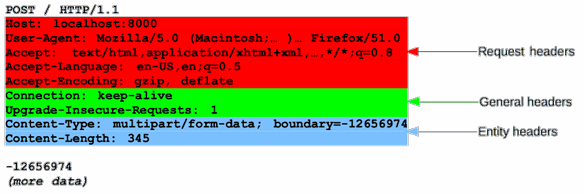
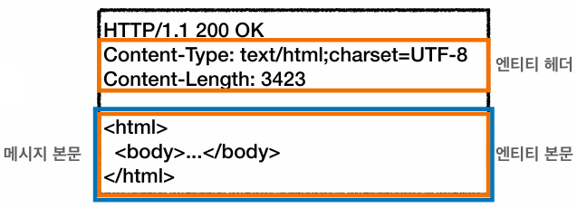
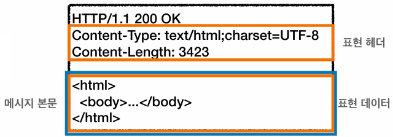
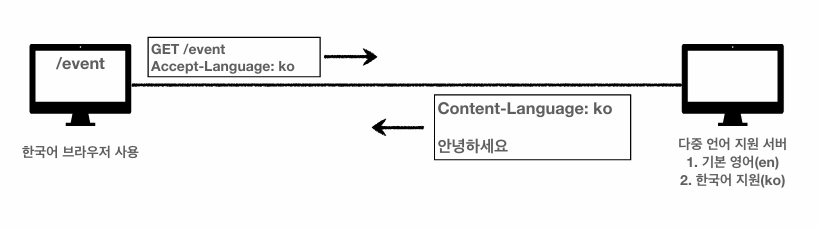
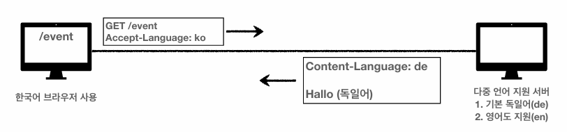
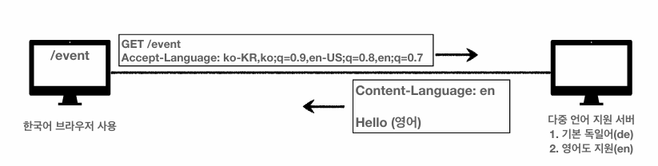

## HTTP 헤더

header-field = field-name ":" OWS field-value OWS
```
...
Host: www.google.com
...
```

```
...
Content-Type: text/html;charset=UTF-8
Content-Length: 3423
...
```

HTTP 전송에 필요한 모든 부가정보 (메시지 바디의 내용, 메시지 바디의 크기, 압축, 인증, 요청 클라이언트, 서버 정보, 캐시 관리 정보 등등)를 포함한다.

> 필요시 임의의 헤더 추가 가능

### RFC2616(과거)

#### HTTP 헤더



* General 헤더 : 메시지 전체에 적용되는 정보
* Request 헤더 : 요청 정보
* Response 헤더 : 응답 정보
* Entity 헤더 : 엔티티 바디 정보

#### HTTP BODY



* 메시지 본문(message body) : 엔티티 본문(entity body)을 전달하는데 사용
* 엔티티 본문 : 요청이나 응답에서 전달할 실제 데이터
* 엔티티 헤더 : 엔티티 본문의 데이터를 해석할 수 있는 정보 제공

<br>

## 표현

### RFC723x 변화

* 엔티티(Entity) → 표현(Representation)
* 표현 = 표현 메타데이터 + 표현 데이터

### HTTP BODY - RFC7230(최신)



* 메시지 본문(message body)을 통해 표현 데이터 전달
* 메시지 본문 = 페이로드(payload)
* 표현 : 요청이나 응답에서 전달할 실제 데이터
* 표현 헤더 : 표현 데이터를 해석할 수 있는 정보 제공

> 표현 헤더는 표현 메타데이터와 페이로드 메시지를 구분해야 하지만, 여기서는 생략함

### Content-Type

```
...
Content-Type: text/html;charset=UTF-8
...
```

```
...
Content-Type: application/json
...
```

표현 데이터의 형식에 대해 설명한다. (미디어 타입, 문자 인코딩)

### Content-Encoding

```
...
Content-Encoding: gzip 
...
```

표현 데이터의 압축하기 위해 사용하며,  데이터를 전달하는 곳에서 압축 후 인코딩 헤더를 추가하고 데이터를 읽는 쪽에서 인코딩 헤더의 정보로 압축 해제하는 방식으로 동작한다.

### Content-Language

```
...
Content-Language: ko
...
```

표현 데이터의 자연 언어를 표현한다. (ko, en, en-US 등)

### Content-Length

```
...
Content-Length: 5

hello
...
```

표현 데이터의 길이를 표현하며, 바이트 단위를 사용한다.

> Transfer-Encoding(전송 코딩)을 사용하면 Content-Length를 사용하면 안됨

<br>

## 콘텐츠 협상

클라이언트가 선호하는 표현을 요청하는 것

* Accept : 클라이언트가 선호하는 미디어 타입
* Accept-Charset : 클라이언트가 선호하는 문자 인코딩
* Accept-Encoding : 클라이언트가 선호하는 압축 인코딩
* Accept-Language : 클라이언트가 선호하는 자연 언어

> 협상 헤더는 요청시에만 사용

### Accept-Language 적용



### Accept-Language 선호 언어를 제공하지 않는다면?



### 협상과 우선순위

```
GET /event 
Accept-Language: ko-KR,ko;q=0.9,en-US;q=0.8,en;q=0.7
```

* Quality Values(q) 값 사용
* 0 ~ 1 클수록 높은 우선순위
* 예시에서의 우선순위
  1. ko-KR;q=1 (q생략)
  2. ko;q=0.9
  3. en-US;q=0.8
  4. en;q=0.7
 


### 협상과 우선순위2

```
GET /event 
Accept: text/*, text/plain, text/plain;format=flowed, */*
```

* 구체적인 것이 우선이다.
* 예시에서의 우선순위
    1. text/plain;format=flowed
    2. text/plain
    3. text/*
    4. \*/\*

<br>

```
Accept: text/*;q=0.3, text/html;q=0.7, text/html;level=1,
 text/html;level=2;q=0.4, */*;q=0.5
```

* 구체적인 것을 기준으로 미디어 타입을 맞춘다.

| Media Type | Quality |
|---|---|
| text/html;level=1 | 1 |
| text/html | 0.7 |
| text/plain | 0.3 |
| image/jpeg | 0.5 |
| text/html;level=2 | 0.4 |
| text/html;level=3 | 0.7 |

<br>

## 전송 방식

### 단순 전송 - Content-Length

```
[서버]
HTTP/1.1 200 OK
Content-Type: text/html;charset=UTF-8
Content-Length: 3423

<html>
  <body>...</body>
</html>
```

### 압축 전송 - Content-Encoding

```
[서버]
HTTP/1.1 200 OK
Content-Type: text/html;charset=UTF-8
Content-Encoding: gzip
Content-Length: 521

lkj123kljoiasudlkjaweioluywlnfdo912u34ljko98udjkl
```

### 분할 전송 - Transfer-Encoding

```
[서버]
HTTP/1.1 200 OK
Content-Type: text/plain
Transfer-Encoding: chunked

5
Hello
5
World
0
\r\n
```

### 범위 전송 - Range, Content-Range

```
[클라이언트]
GET /event
Range: bytes=1001-2000
```

```
[서버]
HTTP/1.1 200 OK
Content-Type: text/plain
Content-Range: bytes 1001-2000 / 2000

qweqwe1l2iu3019u2oehj1987askjh3q98y
```