## 캐시 기본 동작

### 캐시가 없을 때 - 첫 번째 요청

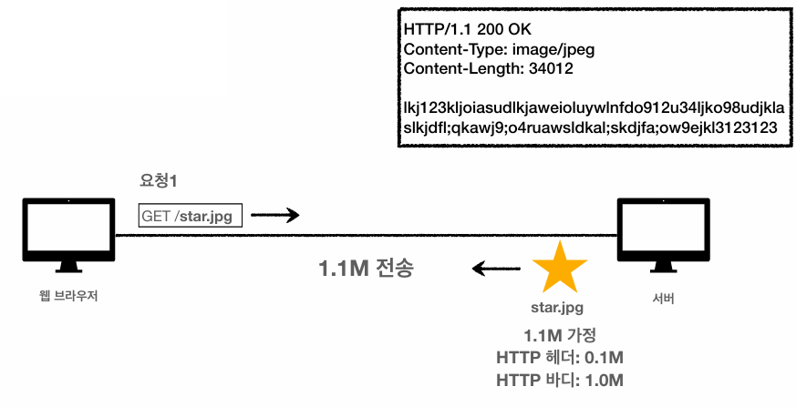
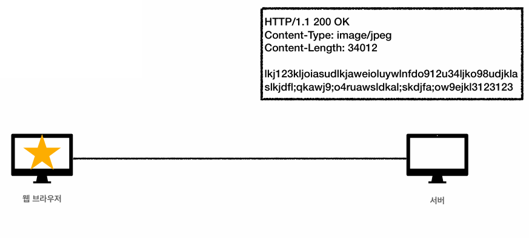

#### 같은 요청을 한번더 한다면?

서버에서는 똑같이 요청을 받아서 응답을 내려 주는데 헤더와 바디를 또 다시 만들어서 전송한다.

* 데이터가 변경되지 않아도 계속 네트워크를 통해서 데이터를 다운로드 받아야 한다.
* 인터넷 네트워크는 매우 느리고 비싸다.
* 브라우저 로딩 속도가 느리다. → 느린 사용자 경험

### 캐시 적용 - 첫 번째 요청

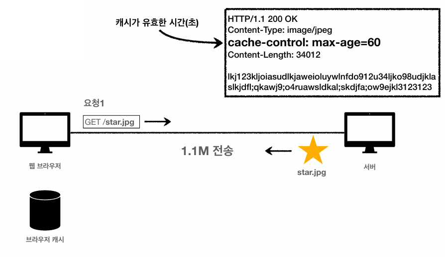
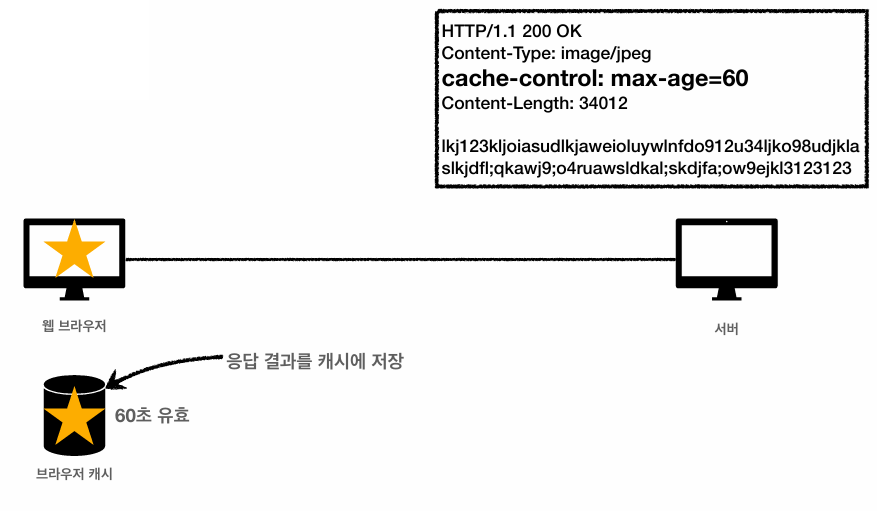

### 캐시 적용 - 두 번째 요청

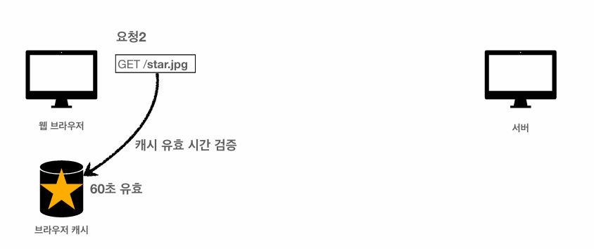
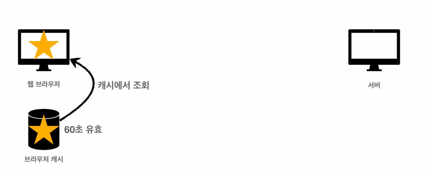

* 캐시 덕분에 캐시 가능 시간동안 네트워크를 사용하지 않아도 된다.
* 비싼 네트워크 사용량을 줄일 수 있다.
* 브라우저 로딩 속도가 매우 빠르다. → 빠른 사용자 경험

### 캐시 시간 초과

* 캐시 유효 시간이 초과하면 서버를 통해 데이터를 다시 조회하고 캐시를 갱신한다.
* 이때 다시 네트워크 다운로드가 발생한다.

<br>

## 검증 헤더와 조건부 요청

### 캐시 만료후에도 서버에서 데이터를 변경하지 않았으면?

* 데이터를 전송하는 대신에 저장해 두었던 캐시를 재사용 할 수 있다.
* 단 클라이언트의 데이터와 서버의 데이터가 같다는 사실을 확인할 수 있는 방법 필요

### 검증 헤더 추가 - 첫 번째 요청

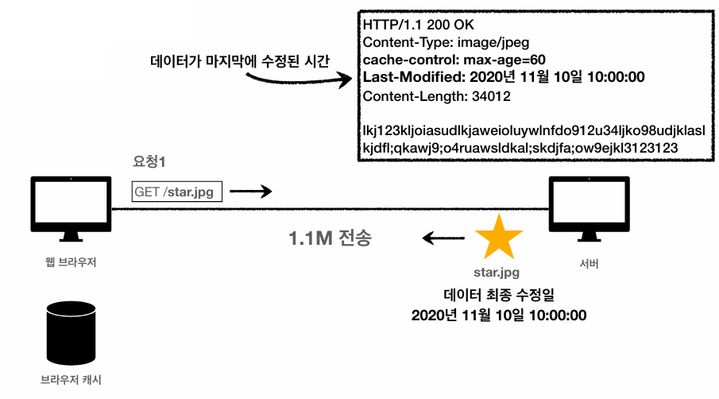
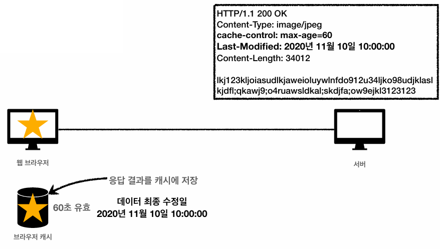

### 검증 헤더 추가 - 두 번째 요청 (캐시 시간 초과)


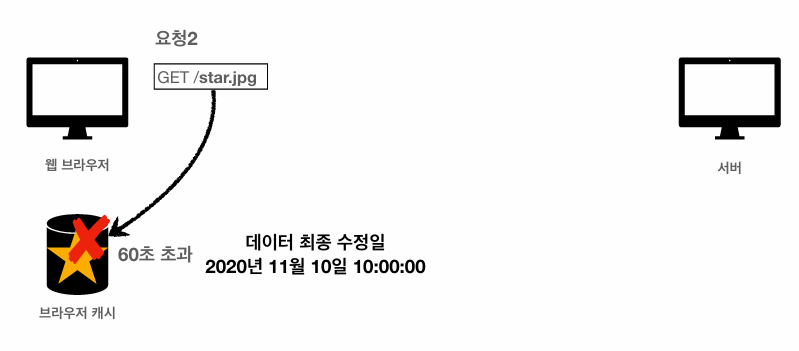
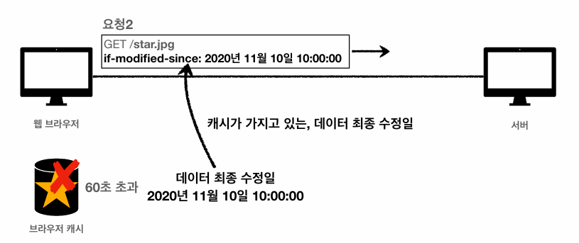

Last-Modified(데이터 최종 수정일)가 있으면 웹브라우저가 서버에 요청을 보낼 때 if-modified-since라는 HTTP 요청 헤더를 붙인 다음에 서버에 넘긴다.

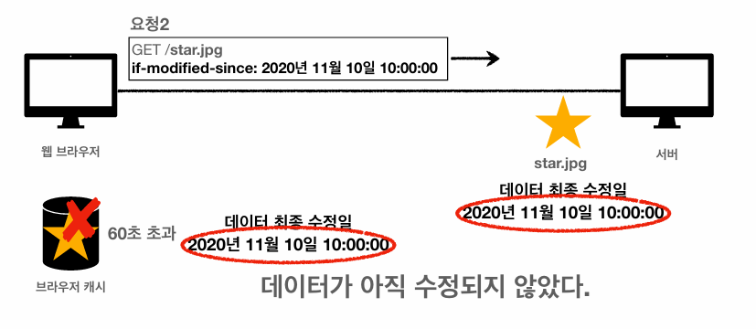
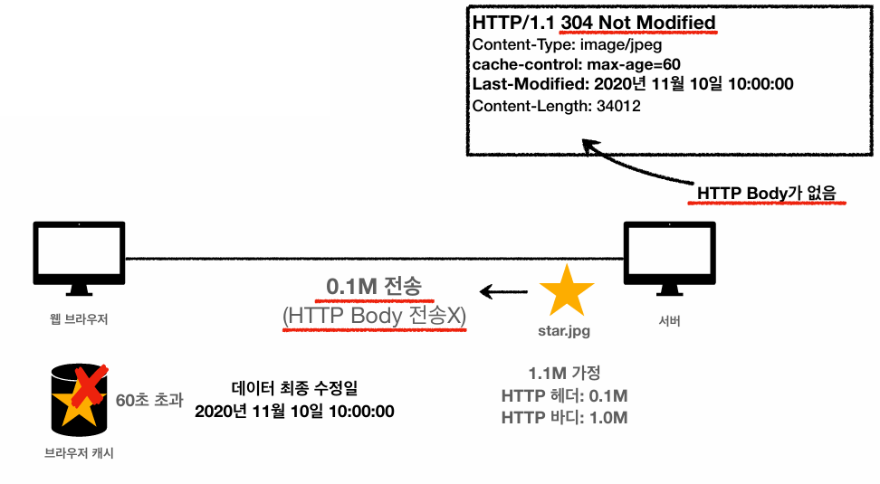

데이터 수정이 없으면 HTTP 응답을 만들 때 304 Not Modified라고 내보낸다. 그리고 수정된게 없기 때문에 HTTP Body 를 빼고 스타트 라인이나 헤더만으로 응답을 만들어서 보낸다. → 헤더 부분만 전송하기 때문에 네트워크 부하를 줄일 수 있다.

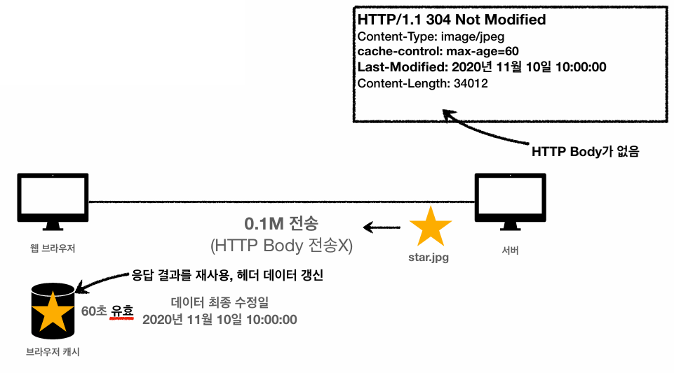
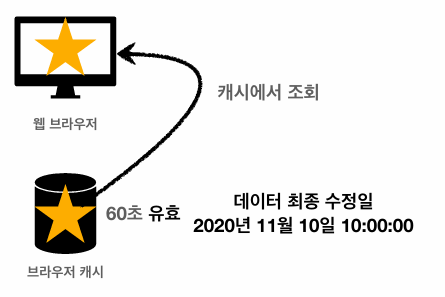

```
[검증 헤더]
Last-Modified: 2020년 11월 10일 10:00:00

[조건부 요청]
if-modified-since: 2020년 11월 10일 10:00:00
```

* 캐시 유효 시간이 초과해도 서버의 데이터가 갱신되지 않으면 304 Not Modified + 헤더 메타 정보만 응답 (바디 X)
* 클라이언트는 서버가 보낸 응답 헤더 정보로 캐시의 메타 정보를 갱신
* 클라이언트는 캐시에 저장되어 있는 데이터 재활용
* 결과적으로 네트워크 다운로드가 발생하지만 용량이 적은 헤더 정보만 다운로드

### 검증 헤더와 조건부 요청

* 검증 헤더
  * 캐시 데이터와 서버 데이터가 같은지 검증하는 데이터
  * Last-Modified, ETag
* 조건부 요청 헤더
  * 검증 헤더로 조건에 따른 분기
  * If-Modified-Since : Last-Modified 사용
  * If-None-Match : ETag 사용
  * 조건이 만족하면 200 OK
  * 조건이 만족하지 않으면 304 Not Modified

#### If-Modified-Since - 이후에 데이터가 수정되었으면?

* 데이터 미변경 예시
  * 캐시: 2020년 11월 10일 10:00:00 vs 서버: 2020년 11월 10일 10:00:00
  * 304 Not Modified, 헤더 데이터만 전송(BODY 미포함)
  * 전송 용량 0.1M (헤더 0.1M)
* 데이터 변경 예시
  * 캐시: 2020년 11월 10일 10:00:00 vs 서버: 2020년 11월 10일 <b>11</b>:00:00
  * 200 OK, 모든 데이터 전송(BODY 포함)
  * 전송 용량 1.1M (헤더 0.1M, 바디 1.0M)

### Last-Modified, If-Modified-Since 단점

* 1초 미만(0.x초) 단위로 캐시 조정이 불가능
* 날짜 기반의 로직 사용
* 데이터를 수정해서 날짜가 다르지만, 같은 데이터를 수정해서 데이터 결과가 똑같은 경우
* 서버에서 별도의 캐시 로직을 관리하고 싶은 경우
  * 예) 스페이스나 주석처럼 크게 영향이 없는 변경에서 캐시를 유지하고 싶은 경우

### ETag, If-None-Match

* 캐시용 데이터에 임의의 고유한 버전 이름을 달아둠
  * ETag: "v1.0", ETag: "a2jiodwjekjl3"
* 데이터가 변경되면 이 이름을 바꾸어서 변경함 (Hash를 다시 생성)
  * ETag: "aaaaa" → ETag: "bbbbb"
* 단순하게 ETag만 보내서 같으면 유지, 다르면 다시 받기

```
[첫 번째 요청]
GET /star.jpg
```

```
HTTP/1.1 200 OK 
Content-Type: image/jpeg 
cache-control: max-age=60 
ETag: "aaaaaaaaaa" 
Content-Length: 34012

lkj123kljoiasudlkjaweioluywlnfdo912u34ljko98udjklasl
 kjdfl;qkawj9;o4ruawsldkal;skdjfa;ow9ejkl3123123
```

```
[두 번째 요청]
GET /star.jpg 
If-None-Match: "aaaaaaaaaa"
```

```
HTTP/1.1 304 Not Modified 
Content-Type: image/jpeg 
cache-control: max-age=60 
ETag: "aaaaaaaaaa" 
Content-Length: 34012

<!-- HTTP Body가 없음 -->
```

* 캐시 제어 로직을 서버에서 완전히 관리한다.
* 클라이언트는 단순히 이 값을 서버에 제공(클라이언트는 캐시 매커니즘을 모름)
  * 예) 서버는 배타 오픈 기간 동안 파일이 변경되어도 ETag를 동일하게 유지
  * 애플리케이션 배포 주기에 맞추어 ETag 모두 갱신

<br>

## 캐시와 조건부 요청 헤더

### Cache-Control - 캐시 지시어

* Cache-Control : max-age
  * 캐시 유효 시간, 초 단위
* Cache-Control : no-cache
  * 데이터는 캐시해도 되지만, 항산 원(origin) 서버에 검증하고 사용
* Cache-Control : no-store
  * 데이터에 민감한 정보가 있으므로 저장하면 안됨 (메모리에서 사용하고 최대한 빨리 삭제)

### Pragma - 캐시 제어(하위 호환)

* Pragma : no-cache / HTTP 1.0 하위 호환

### Expires - 캐시 만료일 지정(하위 호환)

* expires: Mon, 01 Jan 1990 00:00:00 GMT
* 캐시 만료일을 정확한 날짜로 지정
* HTTP 1.0 부터 사용
* 지금은 더 유연한 Cache-Control : max-age 권장
* Cache-Control : max-age 와 함께 사용하면 Expires 는 무시

<br>

## 프록시 캐시

### 원 서버 직접 접근

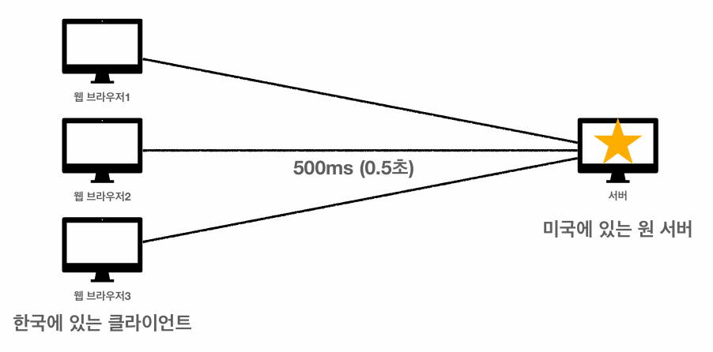

### 프록시 캐시 도입

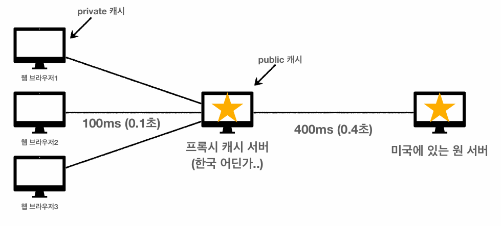

### Cache-Control - 캐시 지시어 (기타)

* Cache-Control : public
  * 응답이 public 캐시에 저장되어도 됨
* Cache-Control : private
  * 응답이 해당 사용자만을 위한 것임, private 캐시에 저장해야 함(기본값)
* Cache-Control : s-maxage
  * 프록시 캐시에만 적용되는 max-age
* Age : 60 (HTTP 헤더)
  * 오리진 서버에서 응답 후 프록시 캐시 내에 머문 시간(초)

<br>

## 캐시 무효화

### Cache-Control - 캐시 지시어 (확실한 캐시 무효화)

* Cache-Control : no-cache
  * 데이터는 캐시해도 되지만, 항상 원 서버에 검증하고 사용
* Cache-Control : no-store
  * 데이터에 민감한 정보가 있으므로 저장하면 안됨
* Cache-Control : must-revalidate
  * 캐시 만료후 최초 조회시 원 서버에 검증해야 함
  * 원 서버 접근 실패시 반드시 오류가 발생해야 함 - 504 Gateway Timeout
  * must-revalidate는 캐시 유효 시간이라면 캐시를 사용함
* Pragma : no-cache
  * HTTP 1.0 하위 호환

### no-cache 기본 동작

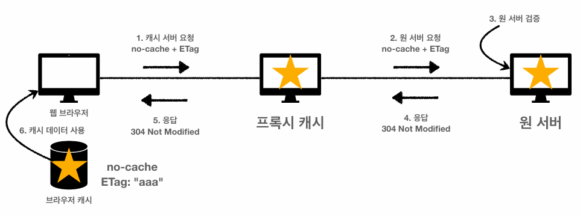

### no-cache 원 서버 접근 불가

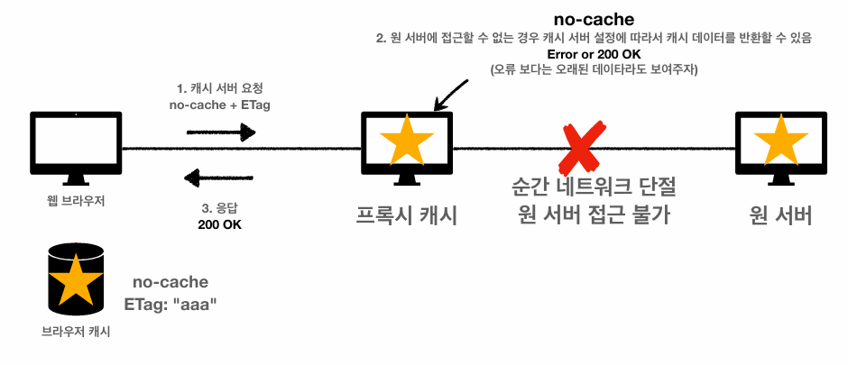

### must-revalidate 원 서버 접근 불가

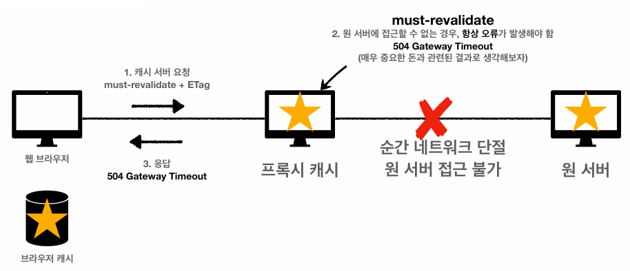