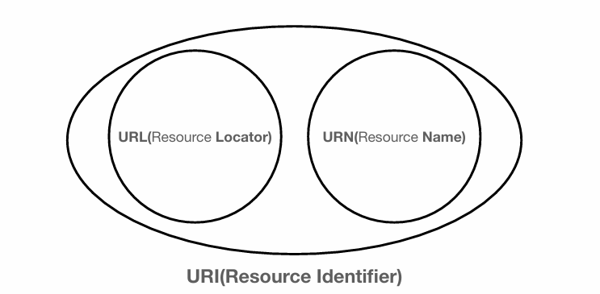

## URI (Uniform Resource Identifier)



URI는 로케이터(Locator)와 이름(Name) 또는 둘다 추가로 분류될 수 있다.

* Uniform - 리소스를 식별하는 통일된 방식
* Resource - URI로 식별할 수 있는 모든 자원
* Identifier - 다른 항목과 구분하는데 필요한 정보

### URL, URN

```
URL
foo://example.com:8042/over/there?name=ferret#nose

URN
urn:example:animal:ferret:nose
```

* URL - Locator : 리소스가 있는 위치를 지정한다.
* URN - Name : 리소스에 이름을 부여한다.

> URN 이름만으로 실제 리소스를 찾는 방법이 보편화 되지 않아 잘 사용하지 않음

<br>

## URL

### 전체 문법

```
문법
scheme://[userinfo@]host[:port][/path][?query][#fragment]

예시
https://www.google.com:443/search?q=hello&hl=ko
```

### scheme

* 주로 프로토콜을 사용한다.
* http는 80 port, https는 443 port를 주로 사용하며, port는 생략할 수 있다.
  
> 프로토콜 : 어떤 방식으로 자원에 접근할 것인가 하는 약속 규칙

> https는 http에 보안이 추가된 것 (HTTP Secure)

### userinfo

* URL에 사용자정보를 포함해서 인증해야할 때 사용한다.
* 거의 사용하지 않는다.

### host

* 도메인명 또는 IP 주소를 직접 사용할 수 있다.

### PORT

* 접속 포트를 나타내며, 일반적으로 생략한다. (http - 80, https - 443)

### path

* 리소스가 있는 경로(path), 계층적 구조

### query

* key = value 형태로 되어있다.
* ?로 시작하며, &로 추가가 가능하다.
  * ?keyA=valueA&keyB=valueB
* query parameter, query string 등으로 불린다.

### fragment

* html 내부 북마크 등에 사용한다.
* 서버에 전송되는 정보는 아니다.