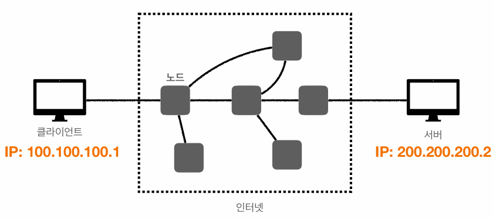
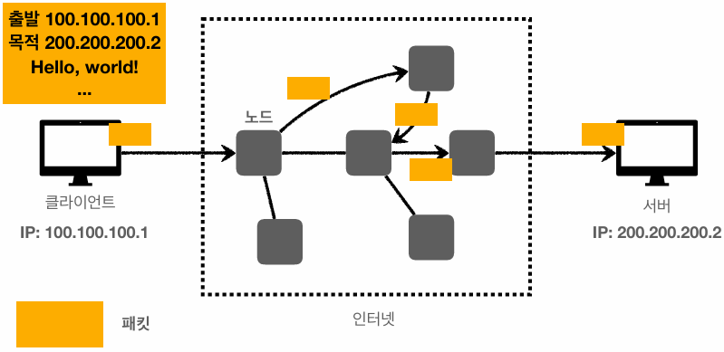
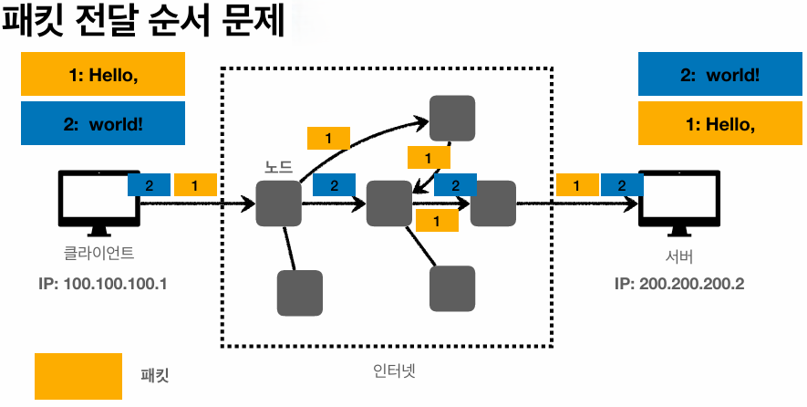
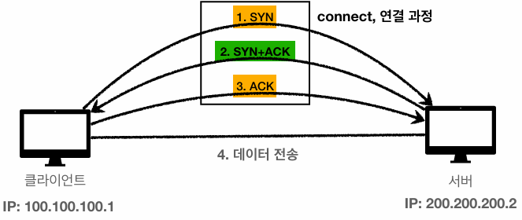

## IP (인터넷 프로토콜)

복잡한 인터넷망에서 데이터를 전송하기 위해서는 최소한의 규칙이 필요하다. 
IP주소가 이를 가능하게 해준다.

* 지정한 IP 주소에 데이터를 전달한다
* 패킷(Packet)이라는 통신 단위로 데이터를 전달한다

 

IP 패킷에 나의 IP와 목적지의 IP 등을 포함해서 인터넷망에 던지면 노드들을 통해 목적지의 IP 주소에 까지 정확하게 전달된다.

 

### IP 프로토콜의 한계

* 비연결성 : 패킷을 받을 대상이 없거나 서비스 불능 상태여도 패킷을 전송한다.
* 비신뢰성 : 패킷이 중간에 사라지거나 순서대로 오지 않을수 있다.
* 프로그램 구분 : 같은 IP를 사용하는 서버에서 통신하는 애플리케이션을 어떻게 구분하기 어렵다.

패킷의 크기가 크면 패킷을 끊어서 보내게 되는데 이 패킷들이 인터넷망에서 서로 다른 노드를 타고 전달될 수 있다. 그렇기 때문에 위 이미지 처럼 클라이언트에서 "Hello," 와 "world!" 순으로 패킷을 보냈음에도 서버에서는 "world!", "Hello," 순으로 잘못 도착한 것을 볼 수 있다.

 

## TCP (Transmission Control Protocol)

IP 프로토콜에서 발생했던 문제들을 TCP가 해결해준다.

TCP/IP 패킷에는 기존 IP 패킷 안에 `출발지 PORT, 목적지 PORT, 전송 제어, 순서, 검증 정보` 등이 추가로 들어가서
IP만으로 해결이 안됐던 문제(순서 제어 문제 등등)들이 해결된다.

### TCP 특징

* TCP 3 way handshake 기법으로 연결을 지향한다.
* 데이터 전달을 보증한다.
* 순서를 보장한다.

> 신뢰적인 데이터 전송

### TCP 3 way handshake 

1. SYN - 클라이언트에서 서버로 SYN(Synchronization : 연결요청)이라는 메시지를 보낸다.
2. SYN + ACK - 서버에서 데이터를 잘 받았다는 의미에서 ACK라는 메시지를 클라이언트한테 보내면서 나도 연결해달라는 의미로 SYN 메시지를 보낸다.
3. ACK - 클라이언트에서 연결 요청을 수락했다는 의미에서 ACK 메시지를 서버에 모낸다.

### 데이터 전달 보증

TCP/IP 에서는 데이터를 전송하면 서버에서 데이터를 잘 받았다고 메시지를 보내준다.
이 메시지를 통해 데이터가 잘 전달됬는지 확인할 수 있다.

### 순서 보장

TCP/IP 에서는 패킷을 순서대로 보냈을때, 서버에 다른 순서로 도착했으면 잘못전달된 순서의 패킷부터 다시 보내달라고 클라이언트에 메시지를 보낸다. 이러한 일련의 과정을 통해
순서가 보장이 될 수 있다.

> 서버에 따라 순서 보장 로직은 달라질 수 있다.

 

## UDP (User Datagram Protocol)

### UDP 특징

* 연결지향 X / 데이터 전달 보증 X / 순서 보장 X
* 데이터 전달 및 순서가 보장되지 않지만, 단순하고 빠르다.

UDP는 IP와 거의 같다. PORT와 체크섬(checksum : 데이터 검증) 정도만 추가되어 있는 프로토콜이다.

> 음성 통화나 영상 스트리밍 등 데이터 전송이 우선시되어야 하는 곳에서 자주 사용한다.

