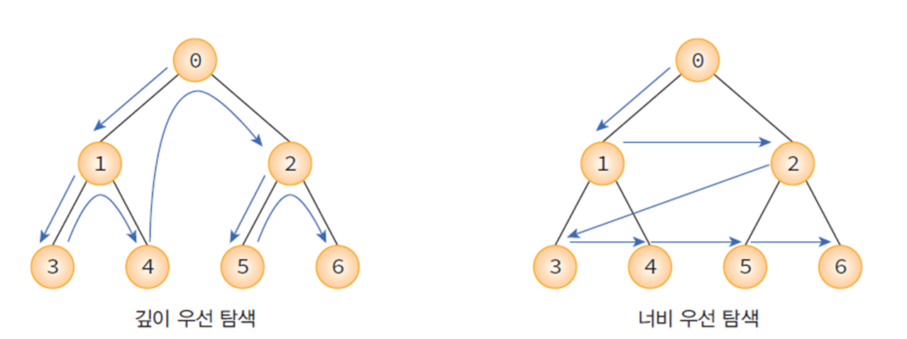
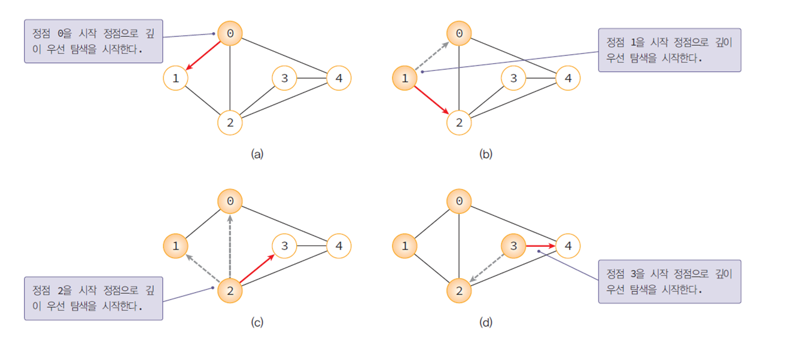
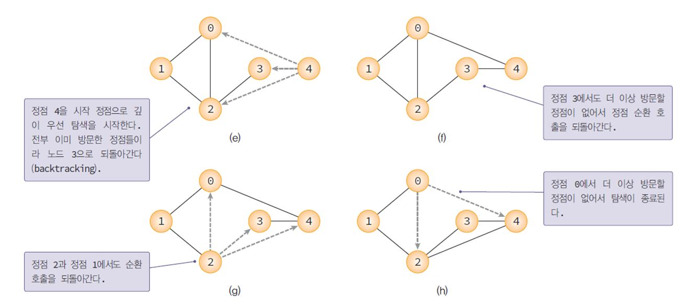
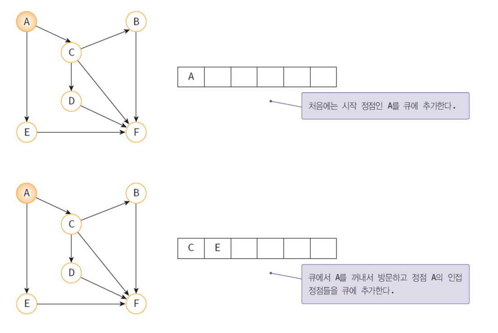
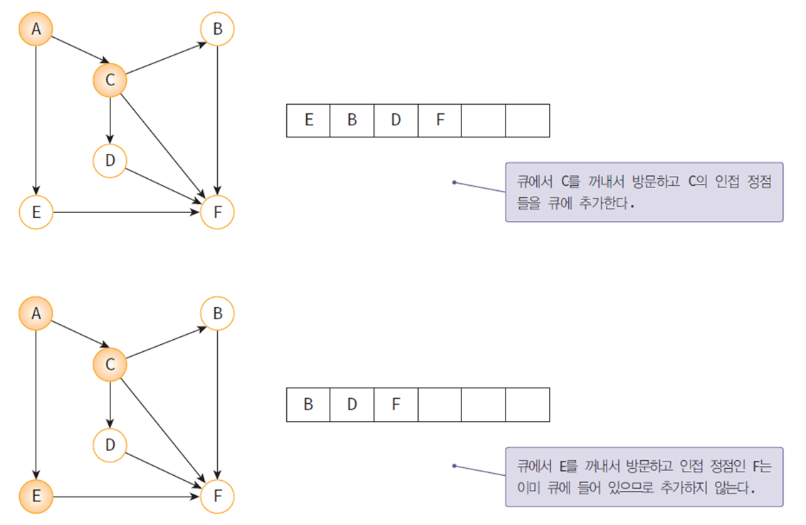
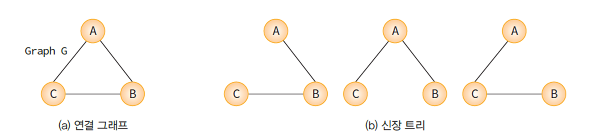
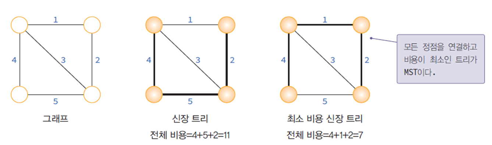

## 그래프 탐색

하나의 정점으로 부터 시작하여 차례대로 모든 정점들을 한번씩 방문한다.
* 깊이 우선 탐색(DFS: depth first search)
* 너브 우선 탐색(BFS: breath first search)



<br>

## 깊이 우선 탐색(DFS)

한 방향으로 갈 수 있을 때까지 가다가 더 이상 갈 수 없게 되면 가장 가까운 갈림길로 돌아와서 이 곳으로부터 다른 방향으로 다시 탐색을 진행한다.
> 되돌아가기 위해서는 스택이 필요하다. (순환함수 호출로 묵시적인 스택 이용 가능)





### 인접 행렬로 표현
```c
void dfs_mat(GraphType* g, int v)
{
    int w;
    visited[v] = TRUE; // 정점 v의 방문 표시 
    printf("정점 %d -> ", v); // 방문한 정점 출력
    for (w = 0; w<g->n; w++) // 인접 정점 탐색
        if (g->adj_mat[v][w] && !visited[w])
            dfs_mat(g, w); //정점 w에서 DFS 새로 시작
}
```

### 인접 리스트로 표현
```c
int visited[MAX_VERTICES];

void dfs_list(GraphType* g, int v)
{
    GraphNode* w;
    visited[v] = TRUE; // 정점 v의 방문 표시 
    printf("정점 %d -> ", v); // 방문한 정점 출력
    for (w = g->adj_list[v]; w; w = w->link) // 인접 정점 탐색 
        if (!visited[w->vertex])
            dfs_list(g, w->vertex); //정점 w에서 DFS 새로 시작
}
```

### 시간 복잡도

* 인접 행렬 : O(n<sup>2</sup>)
* 인접 리스트 : O(n+e)

희소 그래프인 경우 깊이 우선 탐색은 인접 리스트의 사용이 인접 행렬보다 시간적으로 유리함을 뜻한다.

> 희소 그래프 : 노드의 수보다 간선의 수가 적은 그래프

<br>

## 너비 우선 탐색(BFS)

시작 정점으로 부터 가까운 정점을 먼저 방문하고 멀리 떨어져 있는 정점을 나중에 방문하는 순회 방법이다.
> 큐를 사용하여 규현한다.





### 인접 행렬로 표현
```c
void bfs_mat(GraphType* g, int v)
{
    int w;
    QueueType q;

    queue_init(&q); // 큐 초기화 
    visited[v] = TRUE; // 정점 v 방문 표시 
    printf("%d  방문 -> ", v);
    enqueue(&q, v);	// 시작 정점을 큐에 저장 
    while (!is_empty(&q)) {
        v = dequeue(&q); // 큐에 정점 추출 
        for (w = 0; w<g->n; w++) // 인접 정점 탐색 
            if (g->adj_mat[v][w] && !visited[w]) {
                visited[w] = TRUE; // 방문 표시
                printf("%d 방문 -> ", w);
                enqueue(&q, w); // 방문한 정점을 큐에 저장
            }
    }
}
```

### 인접 리스트로 표현
```c
void bfs_list(GraphType* g, int v)
{
    GraphNode* w;
    QueueType q;

    init(&q); // 큐 초기 화 
    visited[v] = TRUE; // 정점 v 방문 표시 
    printf("%d 방문 -> ", v);
    enqueue(&q, v); // 시작정점을 큐에 저장 
    while (!is_empty(&q)) {
        v = dequeue(&q); // 큐에 저장된 정점 선택 
        for (w = g->adj_list[v]; w; w = w->link) //인접 정점 탐색
            if (!visited[w->vertex]) { // 미방문 정점 탐색 
                visited[w->vertex] = TRUE; // 방문 표시
                printf("%d 방문 -> ", w->vextex);
                enqueue(&q, w->vertex); //정점을 큐에 삽입
            }
    }
}
```

### 시간 복잡도

* 인접 행렬 : O(n<sup>2</sup>)
* 인접 리스트 : O(n+e)

깊이 우선 탐색과 마찬가지로 희소 그래프를 사용할 경우 인접리스트를 사용하는 것이 효율적이다.

<br>

## 신장 트리(Spanning Tree)

신장 트리란 그래프 내의 모든 정점을 포함하는 트리다.

* n개의 정점을 가지는 그래프의 신장 트리는 n-1개의 간선을 가진다.



<br>

## 최소 비용 신장 트리(MST: minimum spanning tree)

네트워크(가중치 그래프)에 있는 모든 정점들을 가장 적은 수의 간선과 비용으로 연결한 신장 트리이다.



* 도로 : 도시들을 모두 연결하면서 도로의 길이를 최소가 되도록 하는 문제
* 전기 회로 : 단자들을 모두 연결하면서 전선의 길이를 가장 최소로 하는 문제 
* 통신 : 전화선의 길이가 최소가 되도록 전화 케이블 망을 구성하는 문제
* 배관 : 파이프를 모두 연결하면서 파이프의 총 길이를 최소로 하는 문제

> MST를 구하는 방법으로는 `Kruskal`과 `Prim`이 제안한 알고리즘이 대표적으로 사용된다.