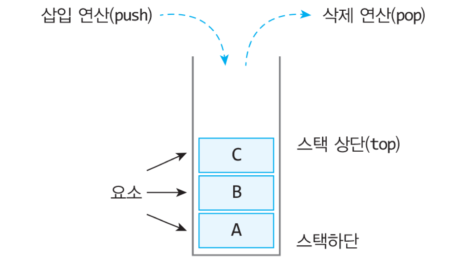
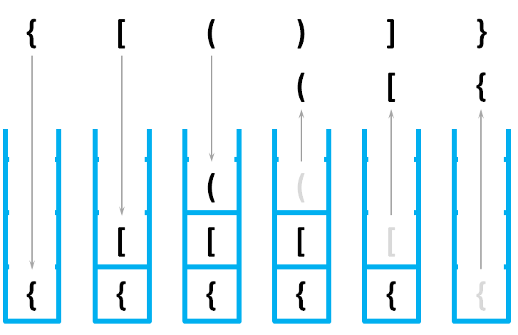

## 스택이란?

스택은 상자더미에서 상자를 꺼내듯이 가장 최근에 들어온 상자가 가장 위에 있게 되고 <br>
먼저 나가게 되는 후입선출(LIFO: Last-In First-Out)의 입출력 형태를 갖는 자료구조이다.

| 스택의 구조 |
| :-: |
|  |

* 스택 상단(top), 스택하단, 요소, 삽입 연산(push), 삭제 연산(pop)

<br>

## 구현

### 알고리즘

스택의 is_empty 연산
```c
is_empty(S):
    if top == -1
        then return TRUE
        else return FALSE
```

> 스택이 비어 있는 지를 검사하기 위하여 top을 -1과 비교한다.

<br>

스택의 is_full 연산
```c
is_full(S):
    if top >= (MAX_STACK_SIZE-1)
        then return TRUE
        else return FALSE
```

> 스택이 가득 차있는지를 검사하기 위하여 top을 (MAX_STACK_SIZE-1)과 비교하여 같으면 포화 상태로 판정한다.

<br>

스택의 push 연산
```c
push(S, x):
    if is_full(S)
        then error "overflow"
        else top←top+1
            stack[top]←x
```

> 스택이 가득 차지 않았나 is_full()을 호출하여 검사한다. 스택이 가득 차 있다면 오류 메시지가 출력되고 함수는 그냥 반환된다.

> 먼저 top의 값을 증가시키고 요소를 top이 가리키는 위치에 삽입한다.

<br>

스택의 pop 연산
```c
pop(S, x):
    if is_empty(S)
        then error "underflow"
        else e←stack[top]
            top←top-1
            return e
```

> 먼저 요소를 제거하기 전에 스택이 비어있는지 is_empty()를 호출하여 검사한다. 비어 있으면 에러 메시지를 출력한다.

> 비어 있지 않으면 top이 가리키는 값을 반환하고 top을 하나 감소시킨다.

<br>

### 코드

```c
// 스택 전역변수

// 공백 상태 검출 함수
int is_empty()
{
    return (top == -1);
}

// 포화 상태 검출 함수
int is_full()
{
    return (top == (MAX_STACK_SIZE - 1));
}

// 삽입 함수
void push(element item)
{
    if(is_full()){
        fprintf(stderr, "스택 포화 에러\n");
        return;
    }
    else stack[++top] = item;
}

// 삭제 함수
element pop()
{
    if(is_empty()){
        fprintf(stderr, "스택 공백 에러\n");
        exit(1);
    }
    else return stack[top--];
}

// 피크 함수
element peek()
{
    if(is_empty()){
        fprintf(stderr, "스택 공백 에러\n");
        exit(1);
    }
    else return stack[top];
}
```

<br>

## 응용 : 괄호검사

스택을 활용하여 괄호들이 올바른 쌍을 이루고 있는지 검사할 수 있다.

* 조건 1. 왼쪽 괄호의 개수와 오른쪽 괄호의 개수가 같아야 한다.
* 조건 2. 같은 종류의 괄호에서 왼쪽 괄호는 오른쪽 괄호보다 먼저 나와야 한다.
* 조건 3. 서로 다른 종류의 왼쪽 괄호와 오른쪽 괄호 쌍은 서로를 교차하면 안 된다.

과정

1. 문자열에 있는 괄호를 차례대로 조사하면서 왼쪽 괄호를 만나면 스택에 삽입한다.
2. 오른쪽 괄호를 만나면 스택에서 맨 위의 괄호를 꺼낸 후 오른쪽 괄호와 짝이 맞는지를 검사한다.
3. 이 때, 스택이 비어 있으면 조건 1 / 조건 2 등을 위배하게 되고 괄호의 짝이 맞지 않으면 조건 3 등에 위배된다.
4. 마지막 괄호까지를 조사한 후에도 스택에 괄호가 남아 있으면 조건 1에 위배되므로 FALSE를 반환하고 그렇지 않으면 TRUE를 반환한다.

<br>

