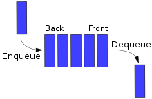
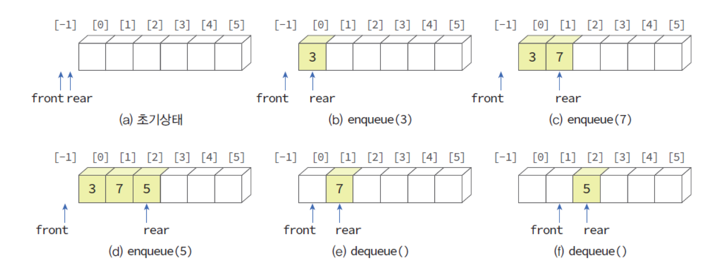
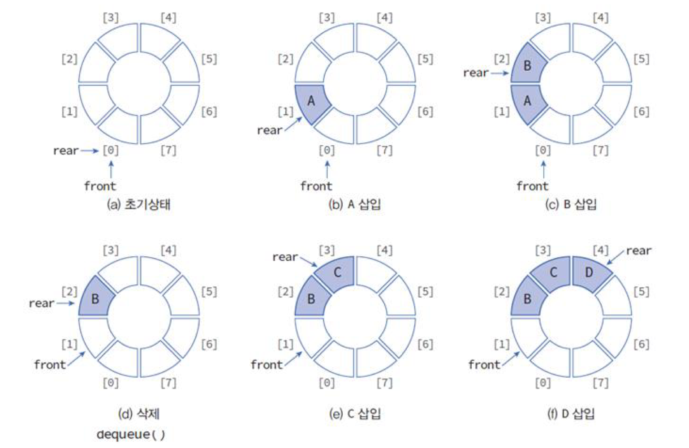

## 큐란?

큐(queue)는 먼저 들어온 데이터가 먼저 나가는 구조로 선입선출(FIFO: First-In First-Out) 특성을 갖는다.

| 큐의 구조 |
| :-: |
|  |

* Enqueue, Dequeue, Back, Front

<br>

## 선형큐

배열을 선형으로 사용하여 구현된 큐이다.

1. 1차원 배열을 정의하고 삽입, 삭제를 위한 변수인 front와 rear를 만든다. 
2. front는 큐의 첫 번째 요소를 가리키고 rear는 큐의 마지막 요소를 가리킨다
3. front와 rear의 초기값은 -1로 데이터가 증가되면 rear를 하나 증가하고 그 위치에 데이터가 저장된다.
4. 삭제할 때도 front를 하나 증가하고 front가 가리키는 위치에 있는 데이터를 삭제한다.



<br>

### 구현

```c
// 구조체 전역변수

// 오류 함수
void error(char *message)
{
	fprintf(stderr, "%s\n", message);
	exit(1);
}

// 초기화 함수
void init_queue(QueueType *q)
{
	q->rear = -1;
	q->front = -1;
}

// 출력 함수
void queue_print(QueueType *q)
{
	for (int i = 0; i<MAX_QUEUE_SIZE; i++) {
		if (i <= q->front || i> q->rear)
			printf("   | ");
		else
			printf("%d | ", q->data[i]);
	}
	printf("\n");
}

// 포화 상태 검출 함수
int is_full(QueueType *q)
{
	if (q->rear == MAX_QUEUE_SIZE - 1)
		return 1;
	else
		return 0;
}

// 공백 상태 검출 함수
int is_empty(QueueType *q)
{
	if (q->front == q->rear)
		return 1;
	else
		return 0;
}

// 삽입 함수
void enqueue(QueueType *q, int item)
{
	if (is_full(q)) {
		error("큐가 포화상태입니다.");
		return;
	}
	q->data[++(q->rear)] = item;
}

// 삭제 함수
int dequeue(QueueType *q)
{
	if (is_empty(q)) {
		error("큐가 공백상태입니다.");
		return -1;
	}
	int item = q->data[++(q->front)];
	return item;
}
```

> 주요 함수만 작성

<br>

### 문제점

선형큐는 이해하기 쉽지만 문제점이 있다. 
* front와 rear의 값이 계속 증가만 하기 때문에 언젠가는 배열의 끝에 도달하게 되고
* 배열의 앞부분이 비어 있더라도 사용하지 못한다는 점이다. 
* 주기적으로 모든 요소들을 왼쪽으로 이동시켜 사용할 수 있지만 상당한 시간이 걸리고 프로그램 또한 복잡해진다.

<br>

## 원형큐

선형큐의 문제점을 해결하기 위해 구조를 원형으로 변경한 형태의 큐이다. <br>
front와 rear의 값이 배열의 끝인 (MAX_QUEUE_SIZE - 1)에 도달하면 다음에 증가되는 값은 0이 되도록 하는 것이다. <br>
원형큐에서는 front와 rear의 개념이 약간 변경된다.

* 초기값이 -1이 아닌 0이다.
* front는 항상 큐의 첫 번째 요소의 하나 앞을,
* rear는 마지막 요소를 가리킨다.
 


> 원형큐에서는 포화 상태와 공백 상태를 구별하기 위해서 하나의 자리는 항상 비워둬야 한다.

<br>

### 알고리즘

원형큐에서의 삽입 알고리즘
```c
enqueue(Q,x):
    rear←(rear+1) % MAX_QUEUE_SIZE;
    Q[rear]←x;
```

원형큐에서의 삭제 알고리즘
```c
dequeue(Q):
    front←(front+1) % MAX_QUEUE_SIZE;
    return Q[front];
```

<br>

### 구현

```c
// 구조체 전역변수

// 오류 함수
void error(char *message)
{
	fprintf(stderr, "%s\n", message);
	exit(1);
}

// 초기화 함수
void init_queue(QueueType *q)
{
	q->front = q->rear = 0;
}

// 공백 상태 검출 함수
int is_empty(QueueType *q)
{
	return (q->front == q->rear);
}

// 포화 상태 검출 함수
int is_full(QueueType *q)
{
	return ((q->rear + 1) % MAX_QUEUE_SIZE == q->front);
}

// 원형큐 출력 함수
void queue_print(QueueType *q)
{
	printf("QUEUE(front=%d rear=%d) = ", q->front, q->rear);
	if (!is_empty(q)) {
			int i = q->front;
			do {
				i = (i + 1) % (MAX_QUEUE_SIZE);
				printf("%d | ", q->data[i]);
				if (i == q->rear)
					break;
			} while (i != q->front);
		}
	printf("\n");
}

// 삽입 함수
void enqueue(QueueType *q, element item)
{
	if (is_full(q))
		error("큐가 포화상태입니다");
	q->rear = (q->rear + 1) % MAX_QUEUE_SIZE;
	q->data[q->rear] = item;
}

// 삭제 함수
element dequeue(QueueType *q)
{
	if (is_empty(q))
		error("큐가 공백상태입니다");
	q->front = (q->front + 1) % MAX_QUEUE_SIZE;
	return q->data[q->front];
}

// 피크 함수
element peek(QueueType *q)
{
	if (is_empty(q))
		error("큐가 공백상태입니다");
	return q->data[(q->front + 1) % MAX_QUEUE_SIZE];
}
```

> 주요 함수만 작성