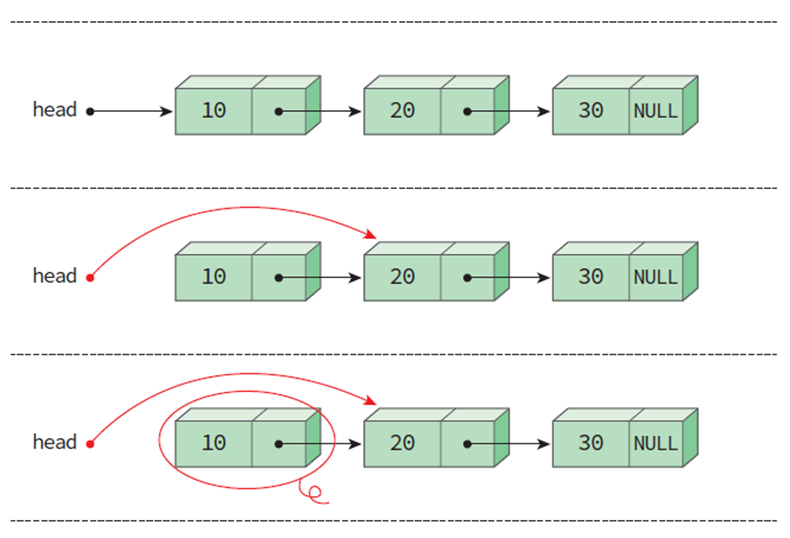

## 연결리스트(Linked List)

각 노드가 데이터와 포인터를 가지고 한 줄로 연결되어 있는 방식으로 데이터를 저장하는 자료 구조이다.

* 리스트의 항목들을 노드(node)라고 하는 곳에 분산하여 저장된다.
* 노드는 데이터 필드와 링크 필드로 구성된다.
    * 데이터 필드 : 리스트의 원소, 즉 데이터 값을 저장하는 곳
    * 링크 필드 : 다른 노드의 주소값을 저장하는 장소 (Pointer)


<br>

### 삽입과 삭제

| 삽입 |
| :-: |
|  |

> N을 삽입하기 위해 B와 C 사이의 연결을 끊고 N을 통해 새롭게 연결시켜 주면 된다.

| 삭제 |
| :-: |
|  |

> 항목 C를 삭제하려고 하면 데이터들을 옮길 필요 없이 데이터들을 연결하는 줄만 수정하면 된다.

<br>

### 장단점

장점
1. 삽입, 삭제가 보다 용이하다.
2. 연속된 메모리 공간이 필요 없다.
3. 크기 제한이 없다
  
단점
1. 구현이 어렵다.
2. 오류가 발생하기 쉽다.

<br>

## 단순 연결 리스트

단순 연결 리스트에서는 노드들이 하나의 링크 필드를 가지며 이 링크 필드를 이용하여 모든 노드들이 연결되어 있다.

* 하나의 링크 필드를 이용하여 연결
* 마지막 노드의 링크 값은 NULL


<br>

### 노드의 정의

노드는 자기 참조 구조체를 이용하여 정의된다. 
* 구조체 안에 데이터를 저장하는 data 필드
* 포인터가 저장되어 있는 link 필드
> 자기 참조 구조체란 자기 자신을 참조하는 포인터를 포함하는 구조체이다.

```c
typedef int element;

typedef struct ListNode {
    element data;
    struct ListNode *link;
} ListNode;
```

### 리스트의 생성

malloc() 함수를 이용하여 노드의 크기만큼의 동적 메모리를 할당 받는다. 동적 메모리의 주소를 헤드 포인터인 head에 저장한다.
이렇게 생성한 노드에 데이터(10)를 저장하고 링크 필드를 NULL로 설정한다.

```c
ListNode *head = NULL;

head = (ListNode *)malloc(sizeof(ListNode)); 

head->data = 10;
head->link = NULL;
```

### 2번째 노드 생성

```c
ListNode *p;
p = (ListNode *)malloc(sizeof(ListNode)); 
p->data = 20;
p->link = NULL; 
```

### 노드의 연결

head->link에 p를 저장하면, 첫 번째 노드의 링크가 두 번째 노드를 가리키게 된다.


```c
head->link = p;
```

<br>

## 단순 연결 리스트의 연산 구현

* insert_first() : 리스트의 시작 부분에 항목을 삽입하는 함수
* insert(): 리스트의 중간 부분에 항목을 삽입하는 함수
* delete_first(): 리스트의 첫 번째 항목을 삭제하는 함수
* delete(): 리스트의 중간 항목을 삭제하는 함수
* print_list(): 리스트를 방문하여 모든 항목을 출력하는 함수

### 삽입 연산 insert_first()

새로운 노드를 하나 생성하고 새로운 노드의 link에 현재의 head 값을 저장한 후, head를 변경하여 새로 만든 노드를 가리키도록 하면 된다.


```c
ListNode* insert_first(ListNode *head, int value)
{
    ListNode *p =
     (ListNode *)malloc(sizeof(ListNode)); //(1)
    p->data = value; //(2)
    p->link = head; //(3) - 헤드 포인터의 값 복사
    head = p; //(4) - 헤드 포인터 변경
    return head; // 변경된 헤드 포인터 반환
}
```

### 삽입 연산 insert()

1. 새로운 노드를 생성하여 변수 p로 가리킨다.
2. p의 데이터 필드에 "35"를 저장한다.
3. p의 링크 필드가 노드 "30"을 가리키게 변경한다.
4. "20"의 링크 필드가 "35"를 가리키도록 한다.
5. 변경된 헤드 포인터 반환


```c
// 노드 pre 뒤에 새로운 노드 삽입
ListNode*  insert(ListNode *head, ListNode *pre, element value)
{
    ListNode *p = (ListNode *)malloc(sizeof(ListNode));	//(1)
    p->data = value; //(2)
    p->link = pre->link; //(3)	
    pre->link = p; //(4)	
    return head; //(5)	
}
```

### 삭제 연산 delete_first()

1. 헤드 포인터의 값을 removed에 복사한다.
2. 헤드 포인터의 값을 head->link로 변경한다.
3. removed가 가리키는 동적 메모리를 반환한다.
4. 변경된 헤드 포인터를 반환한다.



```c
ListNode* delete_first(ListNode *head)
{
    ListNode *removed;
    if (head == NULL) return NULL;
    removed = head; // (1)
    head = removed->link; // (2)
    free(removed); // (3)
    return head; // (4)
}
```

### 삭제 연산 delete()

1. 삭제할 노드를 찾는다.
2. 노드 "10"의 링크 필드가 노드 "30"을 가리키게 한다.
3. 삭제할 노드의 동적 메모리를 반납한다.
4. 변경된 헤드 포인터를 반환한다.


```c
// pre가 가리키는 노드의 다음 노드를 삭제한다. 
ListNode* delete(ListNode *head, ListNode *pre)
{
    ListNode *removed;
    removed = pre->link;
    pre->link = removed->link; // (2)
    free(removed); // (3)
    return head; // (4)
}
```

### 방문 연산 print_list()

노드의 링크값이 NULL이 될때까지 계속 링크를 따라 가면서 노드를 방문하여 출력해주면 된다.

```c
void print_list(ListNode *head)
{
    for (ListNode *p = head; p != NULL; p = p->link)
        printf("%d->", p->data);
    printf("NULL \n");
}
```