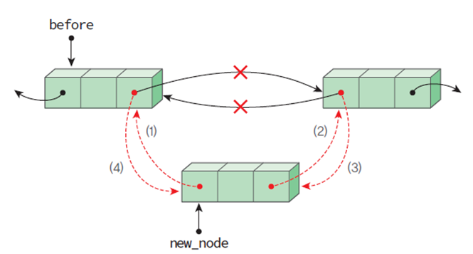

## 원형 연결 리스트

마지막 노드의 링크가 첫 번째 노드를 가리키는 리스트
* 한 노드에서 다른 모든 노드로의 접근이 가능하다


헤드포인터가 마지막 노드를 가리키게끔 구성하면 리스트의 처음이나 마지막에 노드를 삽입하는 연산이 단순 연결 리스트에 비하여 용이하다.


<br>

### 삽입 연산 insert_first()

새로운 노드의 링크인 node->link가 첫 번째 노드를 가리키게 하고 다음에 마지막 노드의 링크가 node를 가리키게 하면 된다.


```c
ListNode* insert_first(ListNode* head, element data)
{
    ListNode *node = (ListNode *)malloc(sizeof(ListNode));
    node->data = data;
    if (head == NULL) {
        head = node;
        node->link = head;
    }
    else {
        node->link = head->link; // (1)
        head->link = node; // (2)
    }
    return head; 
}
```

<br>

### 삽입 연산 insert_last()

원형 연결 리스트는 어차피 원형으로 연결되어 있으므로 어디가 처음이고 어디가 끝인지 불분명하다.<br>
따라서 head의 위치만 새로운 노드로 바꾸어주면 새로운 노드가 마지막 노드가 된다.


```c
ListNode* insert_last(ListNode* head, element data)
{
    ListNode *node = (ListNode *)malloc(sizeof(ListNode));
    node->data = data;
    if (head == NULL) {
        head = node;
        node->link = head;
    }
    else {
        node->link = head->link; // (1)
        head->link = node; // (2)
        head = node; // (3)
    }
    return head;
}
```

<br>

## 이중 연결 리스트

하나의 노드가 선행 노드와 후속 노드에 대한 두 개의 링크를 가지는 리스트이다.


<br>

### 헤드노드

데이터를 가지지 않고 단지 삽입, 삭제 코드를 간단하게 할 목적으로 만들어진 노드이다.
* 헤드 포인터와의 구별 필요
* 공백상태에서는 헤드 노드만 존재

### 노드 구조

```c
typedef int element;
typedef struct DlistNode {
    element data;
    struct DlistNode *llink;
    struct DlistNode *rlink;
} DlistNode;
```

<br>

### 삽입 연산



```c
// 새로운 데이터를 노드 before의 오른쪽에 삽입한다.
void dinsert(DListNode *before, element data)
{
    DListNode *newnode = (DListNode *)malloc(sizeof(DListNode));
    strcpy(newnode->data, data);
    newnode->llink = before;
    newnode->rlink = before->rlink;
    before->rlink->llink = newnode;
    before->rlink = newnode;
}
```

<br>

### 삭제 연산


```c
// 노드 removed를 삭제한다.
void ddelete(DListNode* head, DListNode* removed)
{
    if (removed == head) return;
    removed->llink->rlink = removed->rlink;
    removed->rlink->llink = removed->llink;
    free(removed);
}
```