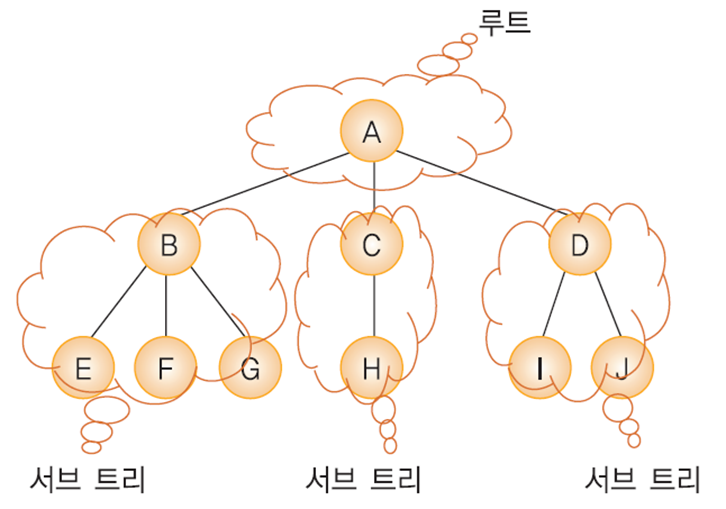
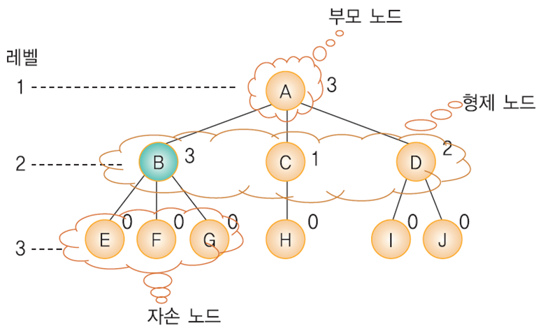
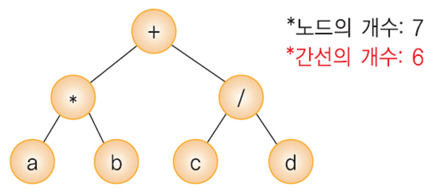
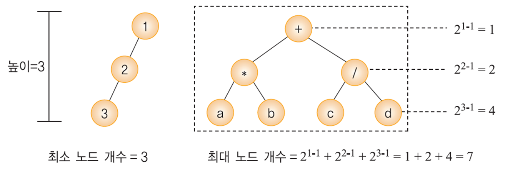
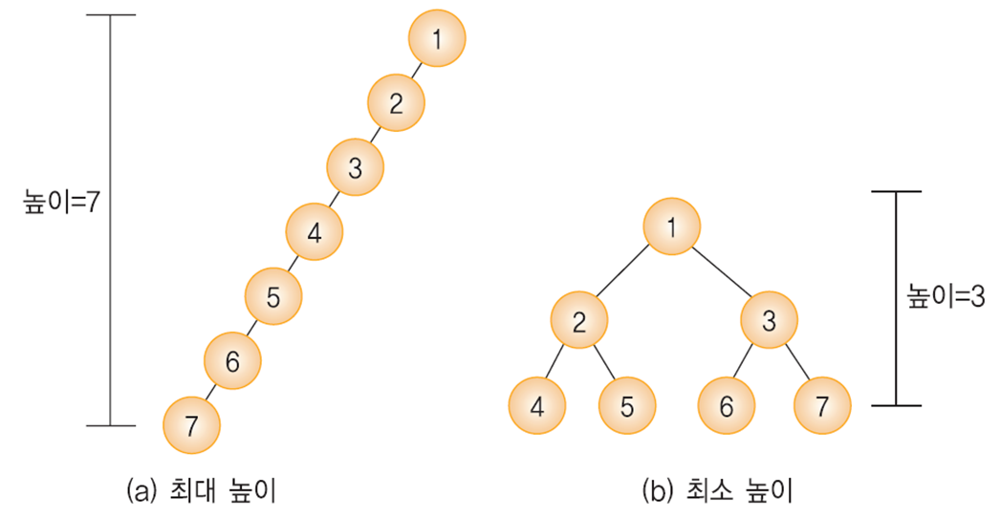
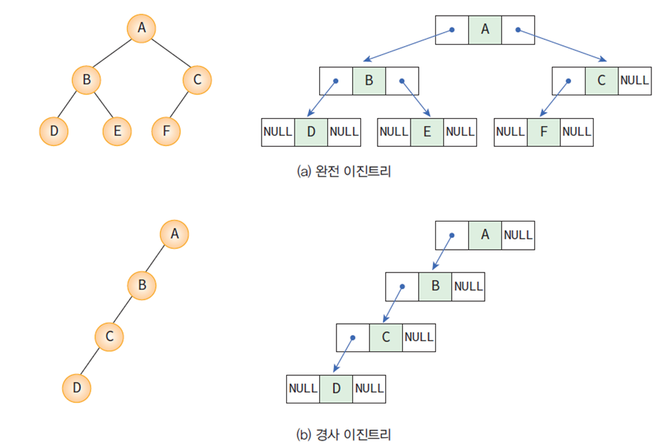
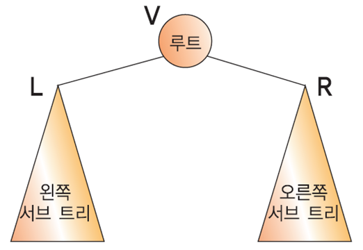
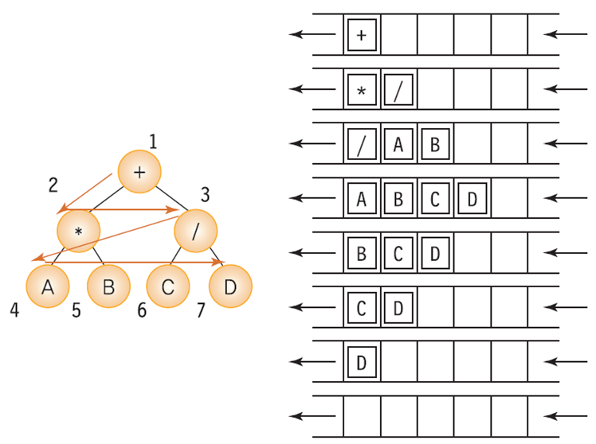

## 트리

계층적인 구조를 나타내는 자료구조로 부모-자식 관계의 노드들로 이루어진다.



* 노드(node): 트리의 구성요소 
* 루트(root): 부모가 없는 노드(A)
* 서브트리(subtree): 하나의 노드와 그 노드들의 자손들로 이루어진 트리
* 단말노드(terminal node): 자식이 없는 노드(A,B,C,D)
* 비단말노드: 적어도 하나의 자식을 가지는 노드(E,F,G,H,I,J)



* 레벨(level): 트리의 각층의 번호
* 높이(height): 트리의 최대 레벨(3)
* 차수(degree): 노드가 가지고 있는 자식 노드의 개수 

<br>

## 이진 트리(binary tree)

모든 노드가 2개의 서브 트리를 가지고 있는 트리이다.

* 이진트리의 노드에는 최대 2개까지의 자식 노드가 존재
* 모든 노드의 차수가 2 이하가 된다 → 구현하기 편리함
* 이진 트리에는 서브 트리간의 순서가 존재

<br>

### 이진 트리의 성질

① 노드의 개수가 n개이면 간선의 개수는 n-1



<br>

② 높이가 h인 이진트리의 경우, 최소 h개의 노드를 가지며 최대 2h-1개의 노드를 가진다.



<br>

③ n개의 노드를 가지는 이진트리의 높이 : 최대 n / 최소 log<sub>2</sub>(n+1)



<br>

### 이진 트리의 분류

* 포화 이진 트리 : 트리의 각 레벨에 노드가 꽉 차있는 이진트리
* 완전 이진 트리 : 레벨 1부터 k-1까지는 노드가 모두 채워져 있고 마지막 레벨 k에서는 왼쪽부터 오른쪽으로 노드가 순서대로 채워져 있는 이진트리

<br>

## 이진 트리 구현 (링크 표현법)

포인터를 이용하여 부모노드가 자식노드를 가리키게 하는 방법



<br>

### 링크의 구현

```c
typedef struct TreeNode {
    int data;
    struct TreeNode *left, *right;
} TreeNode;
```

> 노드는 구조체로, 링크는 포인터로 표현

<br>

### 링크 표현법 이진트리

```c
#include <stdio.h>
#include <stdlib.h>
#include <memory.h>

typedef struct TreeNode {
    int data;
    struct TreeNode *left, *right;
} TreeNode;

void  main()
{
    TreeNode *n1, *n2, *n3;
    n1= (TreeNode *)malloc(sizeof(TreeNode));
    n2= (TreeNode *)malloc(sizeof(TreeNode));
    n3= (TreeNode *)malloc(sizeof(TreeNode));
    n1->data = 10;		// 첫 번째 노드를 설정한다.
    n1->left = n2;
    n1->right = n3;
    n2->data = 20;		// 두 번째 노드를 설정한다.
    n2->left = NULL;
    n2->right = NULL;
    n3->data = 30;		// 세 번째 노드를 설정한다.
    n3->left = NULL;
    n3->right = NULL;
    free(n1); free(n2); free(n3);
    return 0;
}

//     n1
//    /  \
//  n2    n3
```

<br>

## 이진 트리의 순회

순회 : 트리의 노드들을 체계적으로 방문하는 것

* 전위순회(preorder traversal) : VLR
    * 자손노드보다 루트노드를 먼저 방문한다.
* 중위순회(inorder traversal) : LVR 
    * 왼쪽 자손, 루트, 오른쪽 자손 순으로 방문한다.
* 후위순회(postorder traversal)?: LRV
    * 루트노드보다 자손을 먼저 방문한다.



<br>

### 전위 순회

1. 루트 노드를 방문한다
2. 왼쪽 서브트리를 방문한다
3. 오른쪽 서브트리를 방문한다

```c
preorder( TreeNode *root ){
    if ( root ){
         printf("%d", root->data ); // 노드 방문
         preorder( root->left ); // 왼쪽서브트리 순회
         preorder( root->right ); // 오른쪽서브트리 순회
    }
}
```

<br>

### 중위 순회

1. 왼쪽 서브트리를 방문한다
2. 루트 노드를 방문한다
3. 오른쪽 서브트리를 방문한다

```c
inorder( TreeNode *root ){
    if ( root ){
         inorder( root->left );	// 왼쪽서브트리 순회
         printf("%d", root->data ); // 노드 방문
         inorder( root->right ); // 오른쪽서브트리 순회
    }
}
```

<br>

### 후위 순회

1. 왼쪽 서브트리를 방문한다
2. 오른쪽 서브트리를 방문한다
3. 루트 노드를 방문한다

```c
postorder( TreeNode *root ){
    if ( root ){
         postorder( root->left ); // 왼쪽 서브 트리 순회
         postorder( root->right ); // 오른쪽 서브 트리 순회
         printf("%d", root->data ); // 노드 방문
    }
}
```

<br>

### 레벨 순회

레벨 순회는 각 노드를 레벨 순으로 검사하는 순회 방법이다.<br>
지금까지의 순회법이 스택을 사용했던 것에 비해 레벨 순회는 큐를 사용하는 순회법이다.



```c
void level_order(TreeNode *ptr)
{
    QueueType q;

    init_queue(&q);	 // 큐 초기화

    if (ptr == NULL) return;
    enqueue(&q, ptr);
    while (!is_empty(&q)) {
        ptr = dequeue(&q);
        printf(" [%d] ", ptr->data);
        if (ptr->left)
            enqueue(&q, ptr->left);
        if (ptr->right)
            enqueue(&q, ptr->right);
    }
}
```