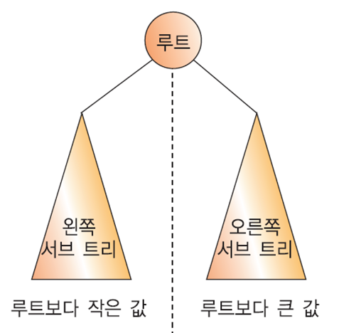
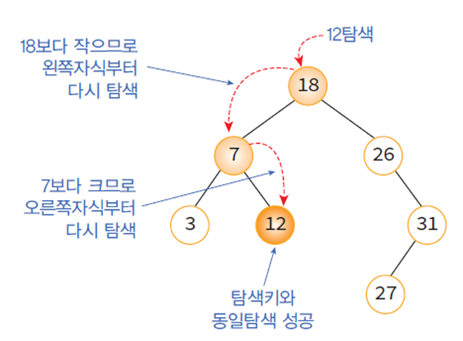
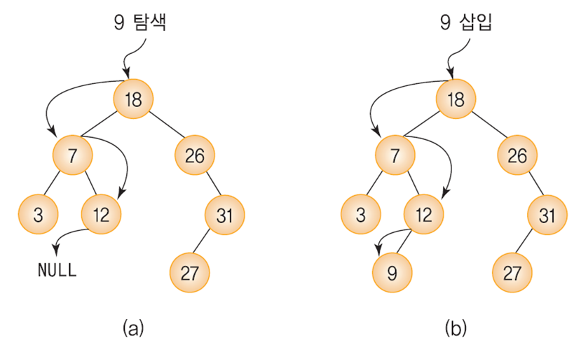
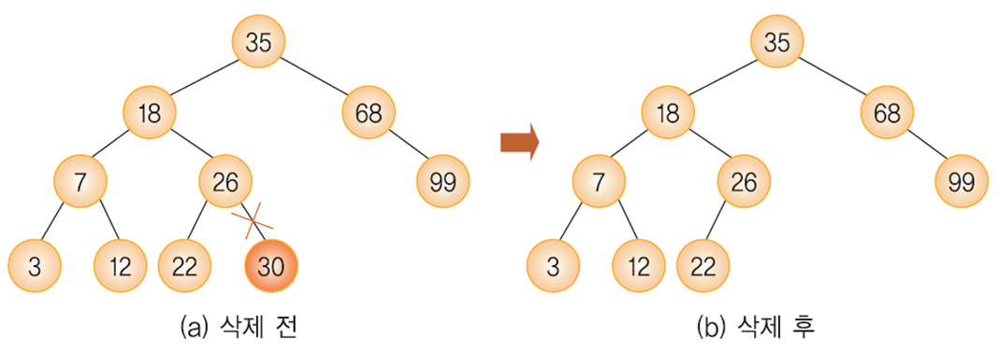
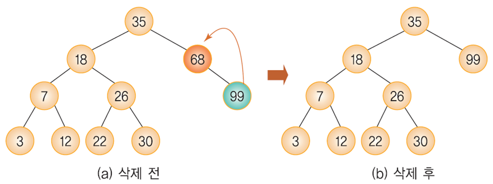
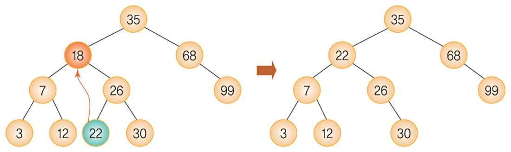
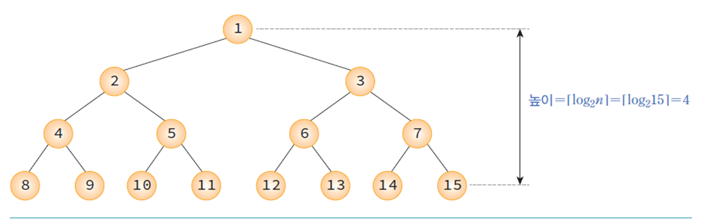
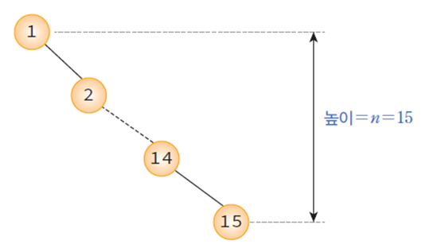

## 이진 탐색 트리

탐색작업을 효율적으로 하기 위한 자료구조이다.

* 모든 원소의 키는 유일한 키를 가진다.
* 왼쪽 서브 트리 키들은 루트 키보다 작다.
* 오른쪽 서브 트리의 키들은 루트의 키보다 크다.
* 왼쪽과 오른쪽 서브 트리도 이진 탐색 트리이다.



<br>

## 탐색연산

1. 비교한 결과가 같으면 탐색이 성공적으로 끝난다.
2. 비교한 결과가, 주어진 키 값이 루트 노드의 키값보다 작으면 탐색은 이 루트 노드의 왼쪽 자식을 기준으로 다시 시작한다.
3. 비교한 결과가, 주어진 키 값이 루트 노드의 키값보다 크면 탐색은 이 루트 노드의 오른쪽 자식을 기준으로 다시 시작한다.



### 순환적 방법

```c
TreeNode *search(TreeNode  *node,  int  key)
{
      if ( node == NULL )  return NULL;
      if ( key == node->key ) return node;     (1)
      else if ( key < node->key )
            return  search(node->left, key);     (2)
      else
            return  sear ch(node->right, key);  (3)
}
```

### 반복적 방법

```c
TreeNode *search(TreeNode *node, int key) 
{ 
    while(node != NULL){ 
     if( key == node->key ) return node; 
     else if( key < node->key ) 
        node = node->left; 
     else 
        node = node->right; 
    } 
    return NULL; // 탐색에 실패했을 경우 NULL 반환
} 
```

<br>

## 삽입연산

이진 탐색 트리에 원소를 삽입하기 위해서는 먼저 탐색을 수행하는 것이 필요하다.<br>
탐색에 실패한 위치가 바로 새로운 노드를 삽입하는 위치이다.



```c
TreeNode * insert_node(TreeNode * node, int key)
{
    // 트리가 공백이면 새로운 노드를 반환한다. 
    if (node == NULL) return new_node(key);

    // 그렇지 않으면 순환적으로 트리를 내려간다. 
    if (key < node->key)
        node->left = insert_node(node->left, key);
    else if (key > node->key)
        node->right = insert_node(node->right, key);

    // 변경된 루트 포인터를 반환한다. 
    return node;
}

TreeNode * new_node(int item)
{
    TreeNode * temp = (TreeNode *)malloc(sizeof(TreeNode));
    temp->key = item;
    temp->left = temp->right = NULL;
    return temp;
}
```

<br>

## 삭제연산

삭제연산은 3가지 경우를 고려하여야 한다.

1. 삭제하려는 노드가 단말 노드일 경우
2. 삭제하려는 노드가 하나의 왼쪽이나 오른쪽 서브 트리 중 하나만 가지고 있는 경우
3. 삭제하려는 노드가 두개의 서브 트리 모두 가지고 있는 경우

### CASE 1 : 삭제하려는 노드가 단말 노드일 경우

단말노드의 부모노드를 찾아서 연결을 끊으면 된다.



### CASE 2 : 삭제하려는 노드가 하나의 서브트리만 갖고 있는 경우

삭제되는 노드가 왼쪽이나 오른쪽 서브 트리 중 하나만 갖고 있을 때, 그 노드는 삭제하고 서브트리는 부모 노드에 붙여준다.



### CASE 3 : 삭제하려는 노드가 두개의 서브트리를 갖고 있는 경우

삭제노드와 가장 비슷한 값을 가진 노드를 삭제노드 위치로 가져온다.



> 후계자 대상 노드는 왼쪽 서브트리의 제일 큰 값과 오른쪽 서브트리의 제일 작은 값이 된다.

```c
TreeNode * delete_node(TreeNode * root, int key)
{
    if (root == NULL) return root;

    // 만약 키가 루트보다 작으면 왼쪽 서브 트리에 있는 것
    if (key < root->key)
        root->left = delete_node(root->left, key);
    // 만약 키가 루트보다 크면 오른쪽 서브 트리에 있는 것
    else if (key > root->key)
        root->right = delete_node(root->right, key);
    // 키가 루트와 같으면 이 노드를 삭제하면 됨
    else {
        // CASE 1 or CASE 2
        if (root->left == NULL) {
            TreeNode * temp = root->right;
            free(root);
            return temp;
        }
        else if (root->right == NULL) {
            TreeNode * temp = root->left;
            free(root);
            return temp;
        }
        // CASE 3
        TreeNode * temp = min_value_node(root->right);

        // 중외 순회시 후계 노드를 복사한다. 
        root->key = temp->key;
        // 중외 순회시 후계 노드를 삭제한다. 
        root->right = delete_node(root->right, temp->key);
    }
    return root;
}

TreeNode * min_value_node(TreeNode * node)
{
    TreeNode * current = node;

    // 맨 왼쪽 단말 노드를 찾으러 내려감
    while (current->left != NULL)
        current = current->left;

    return current;
}

```

<br>

## 성능분석

이진 탐색 트리에서는 탐색, 삽입, 삭제 연산의 시간 복잡도가 트리의 높이를 h라고 했을때 h에 비례한다.

### 최선의 경우

* 이진 트리가 균형적으로 생성되어 있는 경우
* h=log<sub>2</sub>n



### 최악의 경우

* 한쪽으로 치우친 경사 이진 트리의 경우
* h=n
* 순차탐색과 시간복잡도가 같다.

