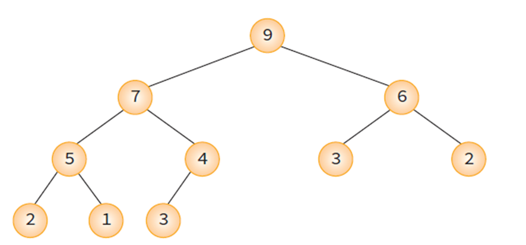
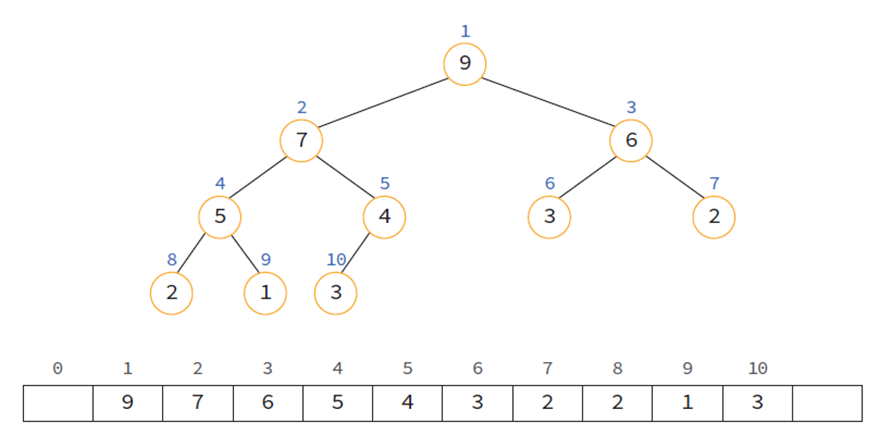
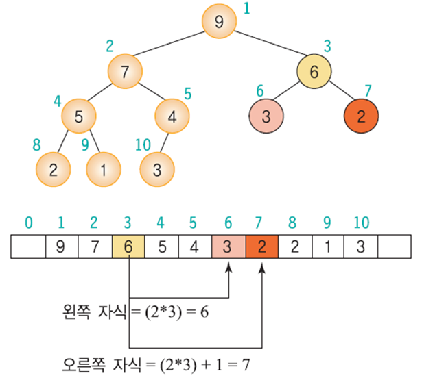
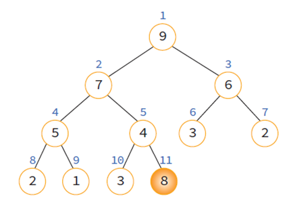
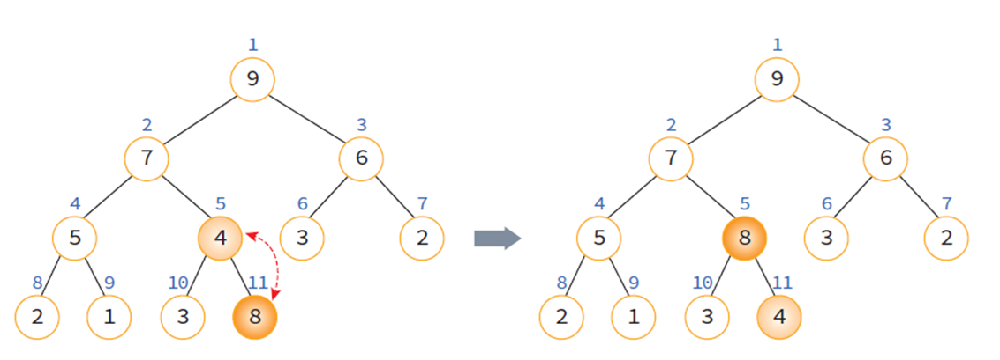
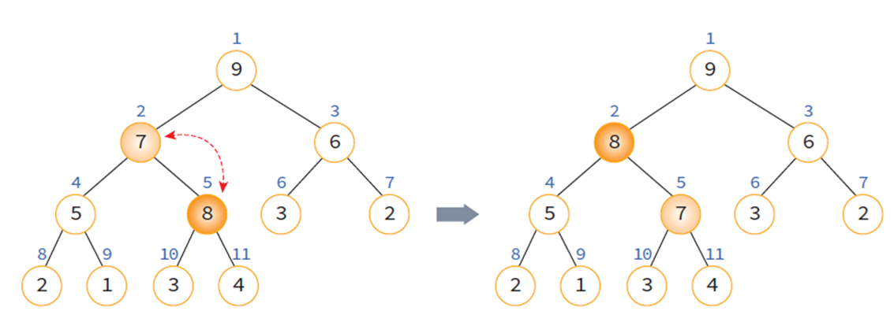
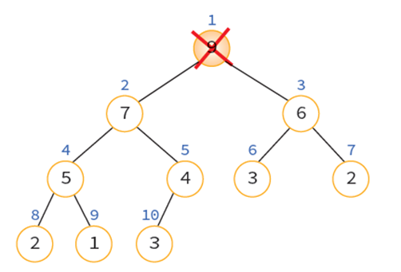
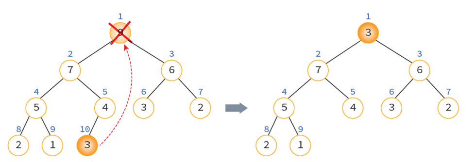
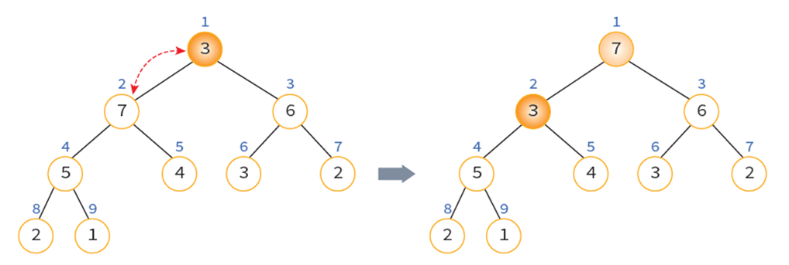
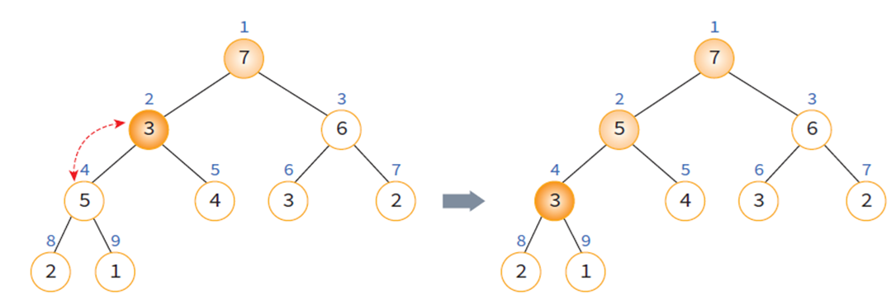

## 우선순위 큐(Priority Queue)

우선순위를 가진 항목들을 저장하는 큐이다.<br>
FIFO 순서가 아니라 우선 순위가 높은 데이터가 먼저 나가게 된다.

### 우선순위 큐 구현방법
1. 배열을 이용한 우선순위 큐
2. 연결리스트를 이용한 우선순위 큐
3. 힙(heap)을 이용한 우선순위 큐

<br>

| 표현 방법 | 삽입 | 삭제 |
| :-: | :-: | :-: |
| 순서없는 배열 | O(1) | O(n) |
| 순서없는 연결 리스트 | O(1) | O(n) |
| 정렬된 배열 | O(n) | O(1) |
| 정렬된 연결 리스트 | O(n) | O(1) |
| 힙 | O(logn) | O(logn) |

<br>

## 힙(Heap)
우선순위 큐를 위해 고안된 자료구조로<br>
노드의 키들이 다음 식을 만족하는 `완전 이진 트리`이다.
* key(부모노드) ≥ key(자식노드)



> 힙 트리에서는 중복된 값을 허용함을 유의해야 한다.

<br>

### 힙 종류

힙에는 두 가지 종류의 힙트리가 존재한다.
* 최대 힙(max heap) : 부모 노드의 키값이 자식 노드의 키값보다 크거나 같은 완전 이진 트리
* 최소 힙(min heap) : 부모 노드의 키값이 자식 노드의 키값보다 작거나 같은 완전 이진 트리

<br>

### 힙의 높이

n개의 노드를 가지고 있는 힙의 높이는 logn이다.
> 힙은 완전 이진 트리, 마지막 레벨 h를 제외하고는 각 레벨 i에 2<sup>i-1</sup>개의 노드가 존재한다.

<br>

## 힙의 구현

### 힙의 구현방법

힙은 배열을 이용하여 구현할 수 있다.
* 완전 이진 트리이므로 각 노드에 번호를 붙일 수 있다.
* 이 번호를 배열의 인덱스라고 생각하면 된다.



<br>

부모노드와 자식노드를 찾기가 쉽다.
* 왼쪽 자식의 인덱스 = (부모의 인덱스) * 2 
* 오른쪽 자식의 인덱스 = (부모의 인덱스) * 2 + 1 
* 부모의 인덱스 = (자식의 인덱스) / 2



<br>

### 정의

```c
#define MAX_ELEMENT 200
typedef struct {
    int key;
} element;

typedef struct {
    element heap[MAX_ELEMENT];
    int heap_size;
} HeapType;

HeapType heap; // 정적 메모리 할당
HeapType *heap = create(); // 동적 메모리 할당
```

<br>

### 삽입 연산

힙에서 삽입 연산은 회사에서 신입 사원이 들어오면 일단 말단 위치에 앉힌 다음에, 신입 사원의 능력을 봐서 위로 승진시키는 것과 비슷하다.
1. 힙에 새로운 요소가 들어 오면, 일단 새로운 노드를 힙의 마지막 노드에 이어서 삽입
2. 삽입 후에 새로운 노드를 부모 노드들과 교환해서 힙의 성질을 만족







```c
// 현재 요소의 개수가 heap_size인 힙 h에 item을 삽입한다.
void insert_max_heap(HeapType *h, element item) 
{
    int i; 
    i = ++(h->heap_size); 

    // 트리를 거슬러 올라가면서 부모 노드와 비교하는 과정
    while((i != 1) && (item.key > h->heap[i/2].key)) {
       h->heap[i] = h->heap[i/2]; 
       i /= 2; 
     }
    h->heap[i] = item; // 새로운 노드를 삽입
}
```

<br>

### 삭제 연산

삭제 연산은 회사에서 사장의 자리가 비게 되면 먼저 제일 말단 사원을 사장 자리로 올린 다음에, 능력에 따라 강등시키는 것과 비슷하다. 

1. 루트 노드를 삭제한다.
2. 마지막 노드를 루트 노드로 이동한다.
3. 루트에서부터 단말 노드까지의 경로에 있는 노드들을 교환하여 힙 성질을 만족시킨다.









```c
// 삭제 함수
element delete_max_heap(HeapType *h) 
{ 
    int parent, child; 
    element item, temp;

    item = h->heap[1];
    temp = h->heap[(h->heap_size)--];
    parent = 1;	
    child = 2;
    while( child <= h->heap_size ) {
      // 현재 노드의 자식노드중 더 큰 자식노드를 찾는다.
      if( ( child < h->heap_size ) && 
          (h->heap[child].key) < h->heap[child+1].key)
          child++;
      if( temp.key >= h->heap[child].key ) break;
      // 한단계 아래로 이동
      h->heap[parent] = h->heap[child];
      parent = child;
      child *= 2;
    }
    h->heap[parent] = temp;
    return item;
}
```

<br>

## 힙 정렬

힙을 이용하면 정렬을 할 수 있다.

* 먼저 정렬해야 할 n개의 요소들을 최대 힙에 삽입
* 한번에 하나씩 요소를 힙에서 삭제하여 저장
* 삭제되는 요소들은 값이 증가되는 순서(최소 힙의 경우)

> 힙 정렬이 최대로 유용한 경우는 전체 자료를 정렬하는 것이 아니라 가장 큰 값 몇 개만 필요할 때이다.

### 복잡도

* 삽입 연산에서 최악의 경우, 루트 노드까지 올라가야 하므로 트리의 높이에 해당하는 비교 연산 및 이동 연산이 필요하다. → `O(logn)`
* 삭제도 최악의 경우, 가장 아래 레벨까지 내려가야 하므로 역시 트리의 높이 만큼의 시간이 걸린다. → `O(logn)`