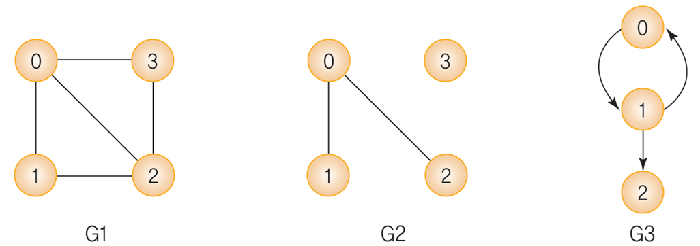
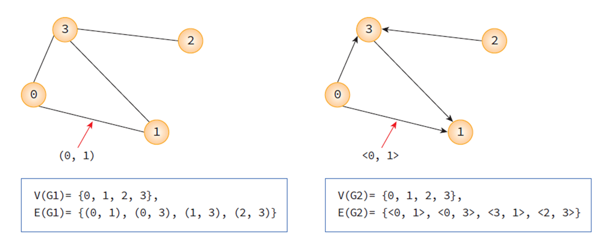
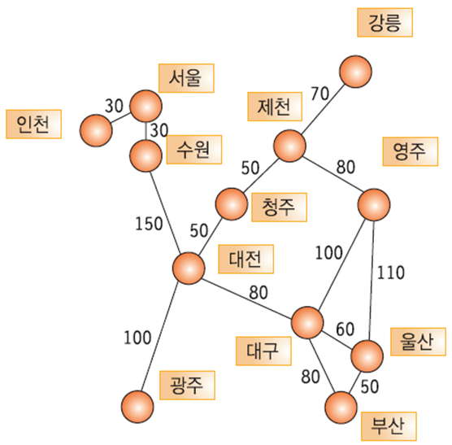
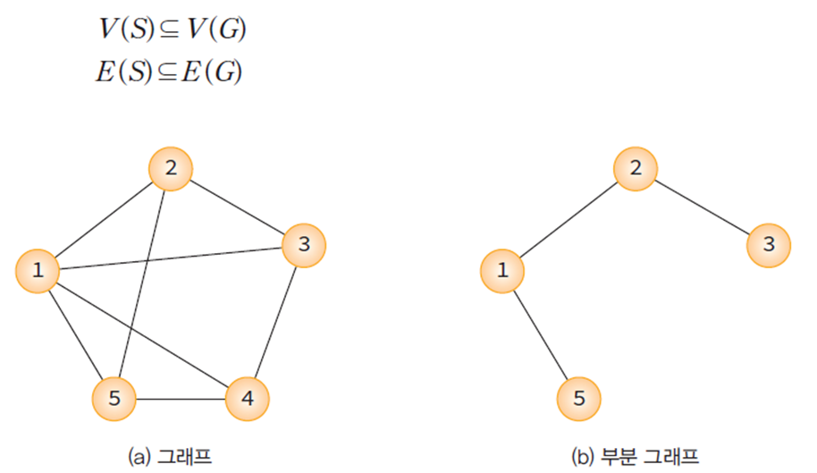
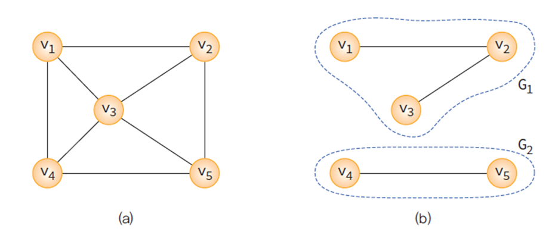
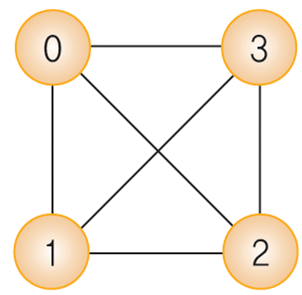
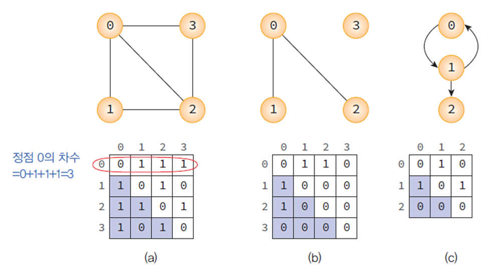
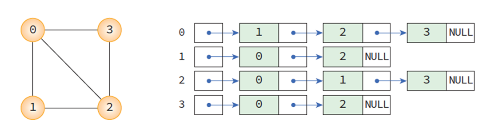

## 그래프(Graph)

연결되어 있는 객체 간의 관계를 표현하는 자료구조이다.

* 정점(vertices)
  * 여러 가지 특성을 가질 수 있는 객체를 의미한다.
  * V(G) : 그래프 G의 정점들의 집합
  * 노드(node)라고도 불린다.
* 간선(edge)
  * 정점들 간의 관계를 의미한다.
  * E(G) : 그래프 G의 간선들의 집합
  * 링크(link)라고도 불린다.


### 표현 예시



V(G1)= {0, 1, 2, 3} / E(G1)= {(0, 1), (0, 2), (0, 3), (1, 2), (2, 3)}<br>
V(G2)= {0, 1, 2, 3} / E(G3)= {(0, 1), (0, 2)}<br>
V(G2)= {0, 1, 2} / E(G2)= {<0, 1>, <1, 0>, <1, 2>}

<br>

### 무방향 그래프와 방향 그래프

간선의 종류에 따라 그래프는 무방향 그래프와 방향 그래프로 구분된다.
* 무방향 그래프의 간선은 (A, B)와 같이 표현한다.
* 방향 그래프의 간선은 <A, B>와 같이 표현한다.



> 정점 A에서 정점 B로만 갈 수 있는 간선은 <A, B>로 표시한다. 방향 그래프에서 <A, B>와 <B, A>는 서로 다른 간선이다.

<br>

### 네트워크

간선에 비용이나 가중치가 할당된 그래프로, 가중치 그래프라고도 한다.



<br>

### 부분 그래프

정점 집합 V(G)와 간선 집합 E(G)의 부분 집합으로 이루어진 그래프이다.



<br>

### 연결 그래프

무방향 그래프 G에 있는 모든 정점쌍에 대하여 항상 경로가 존재하는 그래프이다.



> (b)는 비연결 그래프

<br>

### 완전 그래프

모든 정점이 연결되어 있는 그래프이다.
* n개의 정점을 가진 무방향 완전 그래프의 간선의 수 : n x (n-1)/2



<br>

## 그래프 표현 방법

### 인접행렬(adjacent matrix) 방법

그래프의 정점 수가 n이라면 n x n의 2차원 배열인 인접 행렬 M의 각 원소를 다음의 규칙에 의해 할당함으로써 그래프를 메모리에 표현할 수 있다.

* 간선 (i, j)가 그래프에 존재하면 M[i][j] = 1
* 그렇지 않으면 M[i][j] = 0



> matrix[i][j]가 true라면 i → j 간선이 있다는 뜻이다.

```c
#define MAX_VERTICES 50
typedef struct GraphType {
    int n;	// 정점의 개수
    int adj_mat[MAX_VERTICES][MAX_VERTICES];
} GraphType;
// 정점 삽입 연산
void insert_vertex(GraphType* g, int v)
{
    if (((g->n) + 1) > MAX_VERTICES) {
        fprintf(stderr, "그래프: 정점의 개수 초과");
        return;
    }
    g->n++;
}
// 간선 삽입 연산
void insert_edge(GraphType* g, int start, int end)
{
    if (start >= g->n || end >= g->n) {
        fprintf(stderr, "그래프: 정점 번호 오류");
        return;
    }
    g->adj_mat[start][end] = 1;
    g->adj_mat[end][start] = 1;
}
```
> 주요 함수만 작성

<br>

### 인접 리스트(adjacency list) 방법

각 정점에 인접한 정점들을 연결리스트로 표현하는 방법이다.



```c
#define MAX_VERTICE 50
typedef struct GraphNode {
	int vertex;
	struct GraphNode* link;
} GraphNode;

typedef struct GraphType {
	int n; // 정점의 개수
	GraphNode* adj_list[MAX_VERTICE];
} GraphType;

// 정점 삽입 연산
void insert_vertex_adjList(GraphType* g, int v) {
	if ((g->n) + 1 > MAX_VERTICE) {
		fprintf(stderr, "그래프: 정점의 개수 초과\n");
		return;
	}
	g->n++;
}
// 간선 삽입 연산
void insert_edge_adjList(GraphType* g, int u, int v) {
	if (u >= g->n || v >= g->n) {
		fprintf(stderr, "그래프: 정점 번호 오류\n");
		return;
	}
	GraphNode* node = (GraphNode*)malloc(sizeof(GraphNode));
	node->vertex = v;
	node->link = g->adj_list[u];
	g->adj_list[u] = node;	
}
// 그래프 출력 연산, v를 u의 인접 리스트에 삽입한다.
void print_adj_list(GraphType* g)
{
	for (int i = 0; i < g->n; i++) {
		GraphNode* p = g->adj_list[i];
		printf("정점 %d의 인접리스트", i);
		while (p != NULL) { 
			printf("-> %d ", p->vertex);
			p = p->link;
		}
		printf("\n");
	}
}
```